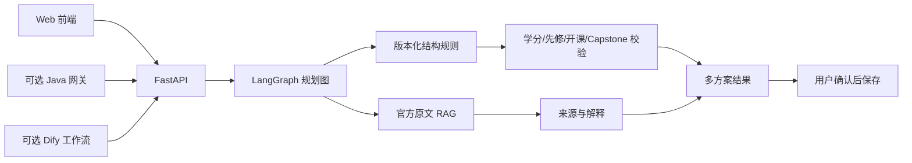

# CampusPilot

CampusPilot 是一个面向澳洲高校留学生的项目比较、课程归属判断和毕业路径规划 Agent。
项目以 Monash University 2026 年 Master of Information Technology（C6001）公开官方资料
作为可复现实例，不使用虚构学校、课程或政策结论。

当前版本适合轻量级本地部署和公开演示。它保留 EduRAG 阶段积累的 FAQ、RAG、Tool Calling、
LangGraph、Deadline、Memory、Checkpoint、用户确认、评估和 MCP 能力，并新增确定性的课程
规则与规划模块。

## 快速运行

```powershell
cd D:\agentdev\edurag-agent-lab
.\.venv\Scripts\python.exe -m pip install -r requirements-app.txt
.\scripts\run_agent_api.ps1
```

打开：

- 用户页面：<http://127.0.0.1:8010/>
- Swagger：<http://127.0.0.1:8010/docs>
- 健康检查：<http://127.0.0.1:8010/health>

页面支持：

- 浏览澳洲八大，并按商科、计算机、工程、数学和物理筛选；
- 按全称、简称或英文名搜索 1412 所中国本科院校和澳洲大学主数据；
- 生成最快完成、负荷均衡、保留弹性三套毕业路径；
- 用“1年制、1.5年制、2年制”等用户语言比较学制、学分和课程结构；
- 检索 Monash 2026 硕士项目的官方录取要求与学分减免路径；
- 学校级申请查询只返回候选项目，具体项目才执行 GPA/WAM 硬判断；
- 判断课程在指定培养方案年份与方向中的角色；
- 检索官方资料片段并返回命中的证据；
- 在保存学习方案前触发 LangGraph Interrupt 用户确认。

院校目录可独立更新：

```powershell
.\.venv\Scripts\python.exe -m pip install -r requirements-data.txt
.\.venv\Scripts\python.exe scripts\campuspilot\build_institution_catalog.py
```

构建脚本只提交清洗后的版本化 JSON；教育部原始 XLS 保存在 `tmp`，不进入 Git。搜索接口
为 `GET /api/admissions/institutions?query=北大&country_code=CN&limit=20`。

## 核心设计



RAG 与结构化规则不是二选一：

- 官方 Handbook、Course Map、课程页和政策原文进入 RAG，用于召回依据、解释和引用；
- 学分、课程角色、先修条件、开课学期等解析为版本化结构数据，用于确定性计算；
- `program_variant_id + handbook_year + study_stream` 共同限定规则作用域；
- 官网变化只进入暂存区，经审核、重新索引和回归测试后再发布。

## 官方数据更新实验

首次归档八校官方种子源：

```powershell
.\.venv\Scripts\python.exe scripts\download_handbook_sources.py
```

原始 HTML、MHTML 和 DOCX 保存在 `data/official_sources/raw/`，默认不进入
Git。`index.json` 保存 URL、Handbook Year、最终地址、SHA-256、内容类型、
文件大小和本地路径。再次执行默认复用已成功快照；需要检查官网变化时显式
使用 `--refresh`。

当前 `data/handbook_source_manifest.json` 是可核验并持续扩展的来源清单。
截至 2026-08-17，清单共有 2193 个来源，其中 2039 个为课程页、143 个为项目页、
8 个为目录入口、2 个为签证政策页；解析结果为 2139 份 `ready` 正文、8 个
`discovery_only` 入口和 46 个不可用来源。当前数据明显集中于 Monash（2157 个来源），
其余七校仍以目录和代表性项目为主，不得表述为澳洲八大五类专业全量库。

将已核验快照转换为待检查 Markdown：

```powershell
.\.venv\Scripts\python.exe scripts\extract_handbook_sources.py
```

解析结果保存在 `data/official_sources/clean/`。目录入口标记为
`discovery_only`，不进入 RAG；项目与政策正文只有达到质量门禁后才标记为
`ready`。

## Handbook 向量索引

Milvus 基础设施配置位于 `deploy/milvus/docker-compose.yml`。准备好本地
BGE-M3 和 Milvus 后执行：

```powershell
.\.venv\Scripts\python.exe -m pip install -r requirements-rag.txt
.\.venv\Scripts\python.exe scripts\build_handbook_vector_index.py `
  --chunks-path data\official_sources\handbook-chunks.jsonl
```

当前切块策略按 Markdown 标题保留语义边界：父块最多 3200 字符，检索子块
最多 1200 字符并重叠 160 字符。2139 份 `ready` 正文生成 16035 个父块和
16797 个子块；每个子块携带学校、项目代码、学科、Handbook Year、来源 URL 和哈希。

可随时生成真实覆盖报告，避免 README 与语料状态漂移：

```powershell
.\.venv\Scripts\python.exe scripts\report_campuspilot_coverage.py
```

真实混合检索实验：

```powershell
.\.venv\Scripts\python.exe scripts\search_handbook_hybrid.py `
  "没有信息技术本科背景，需要完成多少学分？" `
  --university-id monash --program-code C6001 --handbook-year 2026 `
  --reranker-path D:\agentdev\models\ms-marco-MiniLM-L6-v2
```

检索使用 BM25 与 Dense/Milvus 双路召回、RRF 融合、CrossEncoder 重排和父块去重。
开发环境可使用 BGE-M3；低成本展示部署使用 all-MiniLM-L6-v2。当前本机
路径与虚拟机地址已经写入启动脚本默认参数，可直接运行：

```powershell
.\scripts\run_agent_api.ps1 -EnableVectorSearch
```

模型或虚拟机位置变化时，可通过 `-BgeM3Path`、`-MilvusUri` 和
`-MilvusCollection` 覆盖默认值；`.env.example` 用于其他启动方式参考。

```powershell
.\.venv\Scripts\python.exe scripts\check_campuspilot_sources.py --stage-changed
```

脚本计算内容哈希并区分 `new`、`unchanged`、`changed`、`error`。它不会自动发布。推荐流程：

```text
发现变化 -> 暂存原文 -> 解析差异 -> 人工审核关键规则
-> 重建 RAG/结构索引 -> 回归测试 -> 原子切换版本
```

部分官网会拒绝自动抓取。此时应保留旧版本并告警，通过网站允许的下载方式或人工上传更新，
不能把 HTTP 403 当成内容删除。

## 运行实验与测试

```powershell
.\.venv\Scripts\python.exe experiments\campuspilot\official_program_planning_demo.py
.\.venv\Scripts\python.exe experiments\campuspilot\domain_rule_core_demo.py
.\scripts\run_project_checks.ps1
cd java-gateway
mvn test
```

普通单元测试仍使用轻量假实现，不依赖外部服务；本地演示可以通过环境开关
切换到 BM25 + 向量模型 + Milvus 的真实混合检索，并已接入 OpenAI 兼容云端 LLM。
Milvus 启动失败时主服务会降级到 BM25，并在 readiness 中暴露降级原因；Reranker
已作为 RRF 的第三路排名信号接入，故障时保留 BM25 + Dense 融合结果并暴露诊断字段。

## 可选集成

- Java：`java-gateway` 提供 Spring Boot 4.1 薄网关，向企业现有后端暴露稳定接口。
- Dify：`integrations/dify` 提供服务端 Workflow API 接入说明，API Key 不进入浏览器。
- MCP：`experiments/mcp_readonly` 暴露只读 FAQ/RAG 工具。

## 文档

- [CampusPilot 技术文档](docs/CAMPUSPILOT_TECHNICAL_DOCUMENT.md)
- [确定性领域模型](docs/CAMPUSPILOT_DOMAIN_MODEL.md)
- [MySQL 表结构](docs/CAMPUSPILOT_MYSQL_SCHEMA.md)
- [领域核心运行说明](src/campuspilot_core/README.md)
- [轻量服务器部署](docs/CAMPUSPILOT_SERVER_DEPLOYMENT.md)
- [GitHub 与首版生产部署](docs/CAMPUSPILOT_GITHUB_PRODUCTION_DEPLOYMENT.md)
- [国内企业校招时间知识库](docs/CHINA_RECRUITMENT_KNOWLEDGE_BASE.md)
- [录取标准数据底座](docs/ADMISSION_CRITERIA_KNOWLEDGE_BASE.md)
- [录取判断 MVP 规格](docs/ADMISSION_MVP_SPEC.md)
- [实验手册](docs/EXPERIMENT_GUIDE.md)
- [环境与排障](docs/RUNBOOK_ENV_SETUP.md)

## 真实性边界

- 毕业规则演示当前重点覆盖 Monash C6001 2026；录取标准首批覆盖 Monash 2026 的 39 个常见硕士项目。
- 39 个录取项目已进入目录与 RAG，当前只有人工核验完成的 C6001 两条路径开放录取硬判断。
- 八校官方目录均已接入，但目前只有 Monash C6001 开放经过验证的毕业路径。
- `campuspilot_core.seed` 是用于验证通用规则的合成数据，不属于官方知识库。
- 当前未宣称 50 万条数据、90% 准确率或线上降本比例；所有公开指标必须来自可复现实测。
- 学制和课程信息用于规划辅助；签证提示不构成移民或法律建议。
- SQLite、静态演示 token 和本地单实例服务用于演示，不等同于生产架构。
