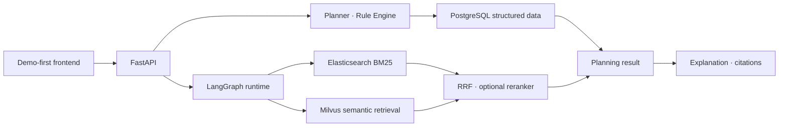

# CampusPilot

一个以官方证据和确定性规则生成可校验毕业路径的海外高校规划 Agent，目前先期版本针对澳洲高校。

[运行 C6001 Demo](#quick-start) · [查看架构](#architecture) · [打开 API 文档](http://127.0.0.1:8010/docs)

> 当前稳定展示面是 Monash University 2026 Master of Information Technology（C6001）。
> 项目不使用虚构学校、课程或政策结论。

## What makes it different

- **Open product exploration**：先围绕选课、培养方案、专业方向和学习路径持续扩展可用场景，再逐步沉淀通用工程能力。
- **Structured planning foundation**：PostgreSQL 保存版本化课程、学分、先修和开课信息，Rule Engine 负责可复用的规划计算。
- **Layered Handbook retrieval**：Elasticsearch 处理代码与关键词检索，Milvus 补充语义召回，RRF 和 reranker 组合官方证据。

## Demo coverage

| 状态 | 范围 | 公开能力 |
| --- | --- | --- |
| **Verified** | Monash C6001 2026 | 三套毕业路径、规则校验、官方 Evidence 卡片 |
| **Discovery** | 澳洲八校公开目录 | 来源发现、目录检索与覆盖率报告；不宣称全量规则覆盖 |
| **Beta API** | Admission / Compare / Pia | 后端接口保留，待 Planner 稳定后逐页迁移前端 |

## Architecture



整体思路是让不同数据形态使用合适的能力：

- PostgreSQL 组织课程、版本、学分、先修和开课学期等结构化信息；
- Elasticsearch 负责 Handbook 原文中的代码、标题和关键词检索；
- Milvus 用于描述性内容和相似语义召回；
- Agent 与 LLM 将规划结果和官方证据组织成易理解的回答。

## Repository map

```text
campuspilot-rag-agent/
├── src/
│   ├── agent_runtime/       # FastAPI · LangGraph · RAG · fallback · logs
│   └── campuspilot_core/    # deterministic domain rules
├── frontend/                # production C6001 Planner UI
├── data/                    # versioned, reproducible public data
├── tests/                   # deterministic and API regression tests
├── eval/                    # measurable quality evaluation
├── scripts/                 # data, indexing and operations entry points
├── deploy/                  # production and Milvus deployment definitions
├── integrations/            # optional Dify and Java adapters
├── experiments/             # optional research prototypes
├── docs/                    # architecture, runbooks and data contracts
├── Dockerfile
├── alembic.ini
└── .env.example
```

`src/`、`frontend/` 和 `deploy/` 构成 production showcase path。
`experiments/` 只包含可选研究原型，不属于公开运行时；`integrations/` 也不是主请求链路。

`data/` 中只提交可复现的轻量目录、manifest、样例和经整理文本。原始网页、运行数据库、
Milvus 数据、模型权重和缓存均被忽略。详细契约见 [data/README.md](data/README.md)。

## Quick Start

```powershell
git clone https://github.com/Yulong713-21/campuspilot-rag-agent.git
cd campuspilot-rag-agent
py -3.10 -m venv .venv
.\.venv\Scripts\python.exe -m pip install -r requirements-app.txt
.\scripts\run_agent_api.ps1
```

打开：

- Planner：<http://127.0.0.1:8010/>
- Swagger：<http://127.0.0.1:8010/docs>
- Health：<http://127.0.0.1:8010/health>

一键推荐场景会生成“最快完成、负荷均衡、保留弹性”三套路径，并展示规则验证与官方证据。

## Data pipeline

来源更新遵循可审计发布链：

```text
发现变化 -> 暂存原文 -> 解析差异 -> 人工审核关键规则
-> 重建 RAG/结构索引 -> 回归测试 -> 原子切换版本
```

版本化来源清单位于 `data/handbook_source_manifest.json`。原始 HTML、MHTML、DOCX 和运行报告
写入被 Git 忽略的 `data/official_sources/`。官网拒绝自动抓取时保留旧版本并告警，不把 HTTP 403
解释为内容删除。

常用命令：

```powershell
.\.venv\Scripts\python.exe scripts\download_handbook_sources.py
.\.venv\Scripts\python.exe scripts\extract_handbook_sources.py
.\.venv\Scripts\python.exe scripts\check_campuspilot_sources.py --stage-changed
.\.venv\Scripts\python.exe scripts\report_campuspilot_coverage.py
```

## RAG and evaluation

Handbook 检索使用 Elasticsearch BM25 与 Dense/Milvus 双路召回，再进行 RRF 融合、可选
CrossEncoder 重排和父块去重。两类索引共享同一份版本化 chunk corpus 与 `chunk_id`。

```powershell
.\.venv\Scripts\python.exe -m pip install -r requirements-rag.txt
.\.venv\Scripts\python.exe scripts\build_handbook_lexical_index.py --recreate
.\.venv\Scripts\python.exe scripts\build_handbook_vector_index.py `
  --chunks-path data\official_sources\handbook-chunks.jsonl
.\scripts\run_project_checks.ps1
```

普通回归测试使用轻量假实现，不要求外部模型或 Milvus。可复现实验放在 `experiments/`，不得反向
成为生产入口。

## Deployment

- `Dockerfile`：FastAPI + production frontend 单容器；
- `deploy/production/`：Compose、Nginx/Caddy 与环境示例；
- `deploy/postgres/`：本地结构化数据服务与迁移入口；
- `deploy/milvus/`：可选 Milvus 配置；
- `scripts/verify_server_deployment.ps1`：live、ready、health、catalog、Planner 和 Evidence 烟测。

GitHub 流程为 `feature -> develop CI -> main -> GHCR immutable image`。镜像构建成功不等同于公网
部署成功；只有目标服务器完成健康门禁和 Planner 烟测后才能声明发布完成。

## Optional integrations

这些组件不出现在首页架构主路径中：

- `integrations/dify/`：服务端 Workflow API 接入说明，API Key 不进入浏览器；
- `integrations/java-gateway/`：可选 Spring Boot 薄适配器，用于已有 Java 认证或审计体系；
- `experiments/mcp_readonly/`：只读 FAQ/RAG 实验工具。

轻量 Demo 只需要 `frontend -> FastAPI -> planner / LangGraph / retrieval`。Java Gateway 不是必需依赖。

## Limitations

- 当前产品体验聚焦 Monash C6001 2026，并持续扩充澳洲高校、项目和课程场景。
- Admission、Compare、Pia 和 Planner 会随着数据覆盖与交互验证逐步开放更多能力。
- `campuspilot_core.seed` 是验证通用规则的合成数据，不属于官方知识库。
- 规划结果用于学习辅助；签证提示不构成移民或法律建议。

## Documentation

- [开发顺序与 Git 分支框架](docs/DEVELOPMENT_SEQUENCE.md)
- [技术架构](docs/CAMPUSPILOT_TECHNICAL_DOCUMENT.md)
- [确定性领域模型](docs/CAMPUSPILOT_DOMAIN_MODEL.md)
- [轻量服务器部署](docs/CAMPUSPILOT_SERVER_DEPLOYMENT.md)
- [GitHub 与生产发布](docs/CAMPUSPILOT_GITHUB_PRODUCTION_DEPLOYMENT.md)
- [环境与排障](docs/RUNBOOK_ENV_SETUP.md)
- [变更记录](CHANGELOG.md)
