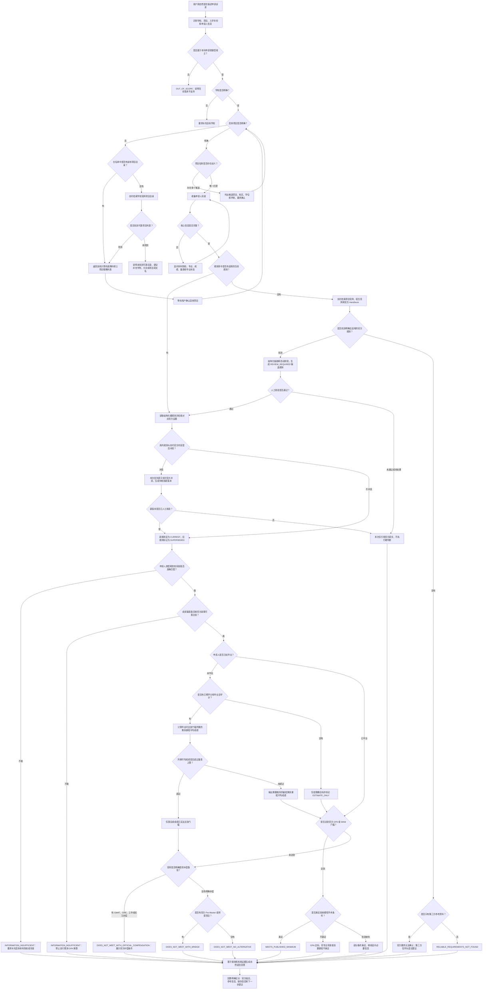
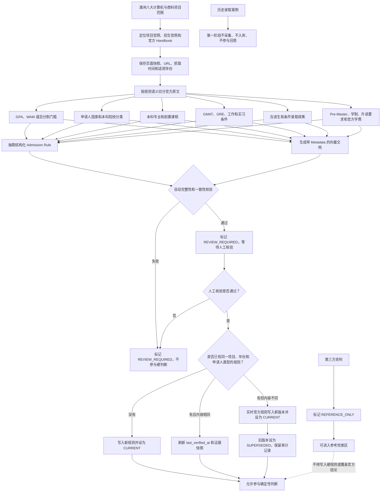
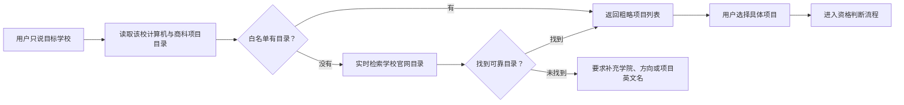

# CampusPilot 本科 GPA 申请硕士判断模块：流程与边界规格

> 文档状态：已按现有 MVP 安全边界评审修订
>
> 最后确认日期：2026-08-01
>
> 与旧规格冲突时，以本文档为准。本文档重点覆盖运行时判断流程、Criteria 入库流程和边界条件；实现细节仍应与现有领域模型保持一致。

## 1. 已确认产品范围

### 1.1 第一版范围

- 申请阶段：本科背景申请授课型硕士。
- 院校范围：澳洲八大全部院校。
- 专业范围：计算机与信息技术、商科。
- 计算机与商科均属于第一版，不再把商科定义为第二阶段。
- 工程不属于第一版，后续再建设。
- 本科申请本科属于未来扩展。
- 博士不在产品开发范围内。

### 1.2 判断口径

- 核心判断依据是本科 GPA、WAM 或学校官方认可的等效成绩。
- GMAT、GRE、实习和工作经验只有在官方明确说明可构成替代或补偿路径时，才能参与确定性判断。
- 第三方资料只能作为参考，不能改变官方硬判断。
- 第一阶段不接入历史录取案例。
- 系统只能判断“是否满足公开最低申请门槛”，不能承诺录取。

### 1.3 数据更新口径

- 优先读取正式项目白名单和已入库规则。
- 白名单或规则库缺失时，转为实时检索学校及项目官网。
- 实时检索到明确、适用且可结构化的官方规则后，本次回答可以临时引用，但只能写入待核验区，不能自动成为正式硬规则。
- 已入库规则与实时官方规则不一致时，本次回答必须提示冲突；实时内容未经核验不得替换正式硬规则。
- 旧规则不得物理覆盖或删除；新规则核验通过后，旧规则才标记为已被新版本取代。
- 第三方信息不能成为当前有效硬规则。

“明确官方规则”至少应同时满足：

1. 来源属于学校、学院、项目官网或官方 Handbook；
2. 能唯一定位学校、项目、学位类型和适用年份或 intake；
3. 能识别规则适用的申请人背景；
4. 门槛、条件或替代路径原文明确，不依赖模型猜测；
5. 结构化结果能够回指官方原文和 URL；
6. 自动校验未发现字段缺失、自相矛盾或明显抽取错误。

## 2. 运行时资格判断总流程



## 3. Criteria 提取、入库与版本更新流程



## 4. 项目未明确时的对话流程

用户只提供学校时，不进行资格判断。



粗略项目列表至少展示：

- 项目官方名称；
- 中文展示名；
- 学院；
- 专业分类；
- 标准学制；
- 校区或授课模式；
- 项目官网；
- 数据来源是白名单还是实时官网检索。

列表不得展示“你能申请”“适合你”等资格结论。

## 5. 数据职责边界

### 5.1 结构化数据库

负责确定性计算和状态判断，至少保存：

- 学校、学院、项目、学位类型；
- 项目版本、适用年份和 intake；
- 计算机或商科专业分类；
- 申请人国家或地区；
- 本科院校名单或院校分类规则；
- 最低 GPA、WAM、百分制及对应量表；
- 本科专业、前置课程和学位背景；
- GMAT、GRE、实习、工作经验的条件类型；
- 条件之间的 AND、OR、N-of-M 关系；
- Pre-Master 或桥梁项目；
- 官方学费、额外学习时间和升读要求；
- 版本状态：`CURRENT`、`SUPERSEDED`、`REVIEW_REQUIRED`；
- 是否允许参与硬判断；
- 官方证据引用。

### 5.2 向量数据库

负责检索官方解释、例外条款和自然语言包装，不直接做数值判断。

建议每个规则语义块形成一份文档，例如：

- GPA/WAM 要求；
- 中国本科院校差异要求；
- 专业背景和前置课程；
- GMAT/GRE 政策；
- 工作或实习条件；
- 在读生和条件录取；
- Pre-Master 或桥梁路径；
- 官方学费和时长。

每份文档至少携带：

```text
university
faculty
program_id
program_name
degree_type
discipline
rule_version
intake
applicant_region
criterion_type
source_type
source_url
source_published_at
retrieved_at
effective_from
effective_to
version_status
hard_decision_allowed
```

### 5.3 LLM

LLM 只负责：

- 从自然语言提取申请槽位；
- 发现缺失信息并生成追问；
- 依据规则服务结果和检索证据组织自然语言；
- 将第三方内容放入明确标识的参考区。

LLM 不得：

- 发明 GPA 换算关系；
- 修改最低门槛；
- 将“推荐”解释成“可替代”；
- 用第三方案例覆盖官方规则；
- 将满足最低线描述成保证录取。

## 6. 结果状态定义

| 状态 | 使用条件 | 用户表达重点 |
|---|---|---|
| `PROJECT_SELECTION_REQUIRED` | 用户只给学校，没有具体项目 | 先选项目，暂不判断 |
| `MEETS_PUBLISHED_MINIMUM` | 满足官方公开最低门槛及已知硬条件 | 满足最低申请门槛，不保证录取 |
| `DOES_NOT_MEET_WITH_OFFICIAL_COMPENSATION` | 尚未达标，但存在明确补偿路径 | 说明需要达到的考试或经历条件 |
| `DOES_NOT_MEET_WITH_BRIDGE` | 不能直接申请，但存在官方衔接项目 | 展示要求、额外时间和官方学费 |
| `DOES_NOT_MEET_NO_ALTERNATIVE` | 不满足且未发现官方替代方案 | 当前不满足公开要求 |
| `INFORMATION_INSUFFICIENT` | 量表、院校映射、背景课程等缺失 | 明确列出需要补充的信息 |
| `RELIABLE_REQUIREMENTS_NOT_FOUND` | 项目明确，但没有可靠规则 | 不能判断，建议核对项目名称或联系学校 |
| `OUT_OF_SCOPE` | 不属于本科申请授课型硕士 | 说明当前产品范围 |

`REVIEW_REQUIRED` 是规则和证据的内部审核状态，不是当前对外资格判断状态。候选规则处于该状态时，对外返回 `RELIABLE_REQUIREMENTS_NOT_FOUND`，并明确说明规则等待核验。即使实时官网规则明确且自动校验通过，也必须完成人工核验后才能写入正式规则库并参与硬判断。

当前 MVP 只识别“官方补偿路径是否存在”，尚未建立 GMAT、GRE、实习或工作经验的完整用户条件字段，因此不输出“已经满足替代路径”的新状态。后续完成替代路径规则模型和申请人证据校验后，再单独评审状态扩展。

## 7. 在读学生成绩目标

### 7.1 精确计算条件

必须同时获得：

- 当前累计 GPA/WAM；
- 成绩量表；
- 已完成学分；
- 毕业总学分或剩余学分；
- 项目要求的目标成绩；
- 本科院校的成绩计算方式能够与目标规则匹配。

公式：

```text
剩余课程所需平均成绩
=（目标毕业平均成绩 × 毕业总学分
  - 当前累计平均成绩 × 已完成学分）
  ÷ 剩余学分
```

### 7.2 计算边界

- 缺少学分时只能返回估算，并标记 `ESTIMATE_ONLY`。
- 计算结果超过量表最高分时，说明仅靠后续课程已无法达到门槛。
- 项目只看最后两年、专业课或特定课程时，不得使用总 GPA 公式。
- 重修、补考、Pass/Fail 和交换课程是否计入，应服从本科院校规则；规则未知时不得精确计算。
- 当前已经达到门槛时，只说明当前状态达标，最终以毕业成绩和学校审核为准。
- 输出使用“达到公开最低门槛所需成绩”，不使用“保证录取所需成绩”。

## 8. GMAT、GRE、实习和工作经验边界

抽取和判断必须区分：

| 类型 | 含义 | 能否补偿 GPA |
|---|---|---|
| `REQUIRED` | 强制提交或满足 | 不能自动推断 |
| `RECOMMENDED` | 建议提交 | 不能 |
| `OPTIONAL` | 可选材料 | 不能 |
| `WAIVER` | 满足条件后可豁免某项要求 | 只影响被豁免项 |
| `ALTERNATIVE` | 官方明确认可的替代路径 | 可以，严格按适用条件 |
| `COMPENSATORY` | 官方明确可弥补较弱成绩 | 可以，严格按适用条件 |

“学校重视实习”“建议提交 GRE”或第三方经验分享，都不能推导出能够补偿 GPA。

## 9. Pre-Master、时间和费用边界

- 语言班只能解决语言要求，不能作为 GPA 补偿路径。
- 只有官方 Pre-Master、Foundation、Qualifying Program 或桥梁项目才能进入衔接建议。
- 展示官方学费时必须说明币种、适用年份、按年还是项目总额。
- 展示额外学习时间和明确的升读要求。
- 签证费和保险可以作为额外支出提示；没有可靠官方金额时不展示具体数字。
- 住宿、生活和交通因人而异，只提示需要额外考虑，不做数值估算。
- 完成衔接项目不应被表达为无条件保证升读，除非官方明确给出保证且用户满足全部条件。

## 10. 证据优先级与冲突规则

证据优先级：

```text
同项目、同 intake 的实时官方项目规则
> 同项目的当前官方招生页面或 Handbook
> 学院当前官方招生政策
> 学校当前通用招生政策
> 已入库的旧版官方规则
> 可信第三方资料
```

冲突处理：

1. 先比较是否属于同一项目、校区、学位、年份和申请人类型；不同适用范围不构成真正冲突。
2. 同一适用范围发生冲突时，本次回答优先提示最新实时官方页面及冲突，但未核验内容不直接执行硬判断。
3. 新规则先创建 `REVIEW_REQUIRED` 版本；人工核验通过后设为 `CURRENT`，旧规则才改为 `SUPERSEDED`，禁止原地覆盖。
4. 保存新旧原文、URL、抓取时间和变更字段，保证可审计。
5. 官网内部仍存在无法解释的当前冲突时，内部规则状态降级为 `REVIEW_REQUIRED`，对外返回 `RELIABLE_REQUIREMENTS_NOT_FOUND`。
6. 第三方内容永远不能覆盖官方内容。

## 11. 关键边界条件清单

### 11.1 项目识别

- 用户只说学校，没有具体项目；
- 中文简称、英文简称、旧项目名称或拼写错误；
- 同名项目属于不同学院；
- 同一项目存在不同校区、授课模式或学制；
- 项目已停招、改名、合并或只在部分 intake 招生；
- 用户选择的是研究型硕士，应明确是否排除或转人工确认；
- 白名单外项目只能使用实时检索能力，不能伪装成已核验白名单项目。

### 11.2 成绩和申请人背景

- `3.2` 不能默认解释为 `3.2/4.0`；
- 百分制、4 分制、7 分制之间不得自行线性换算；
- 中国本科院校必须使用具体学校名称匹配目标大学认可规则；
- 用户自报的 985、211、双一流或双非标签不能直接作为最终映射；
- 官网只写 `competitive`、`strong academic record` 等定性表达时，不能生成数值门槛；
- 官方“建议成绩”和“最低成绩”必须分开；
- 项目可能只计算最后两年、专业课或特定课程；
- 本科专业名称相似不代表满足前置课程；
- 双学位、专升本、Top-up、荣誉学位和非标准学历进入单独背景判断。

### 11.3 证据与检索

- 搜不到规则不等于学校没有规则；
- 其他年份的规则不能直接套用；
- 搜索摘要不能代替官网正文；
- 页面来自官方域名不等于抽取结果一定正确；
- PDF、动态网页或地区重定向页面需要保留实际证据快照；
- 官网实时规则明确且校验通过时可进入待核验区；人工核验通过后才能进入正式规则库；
- 第三方材料必须显式标记“仅供参考”。

### 11.4 回答表达

- 不使用“稳录”“保证录取”“一定可以”；
- 达标时使用“满足公开最低申请门槛”；
- 不达标但有替代路径时，说明这是官方条件路径，而不是自动录取；
- 只有第三方参考时，先说明官方要求未满足或无法确认，再给尝试建议；
- 回答必须引用对应官方来源；
- 清楚区分已知事实、推断、估算和缺失信息。

## 12. 自然语言回答契约

最终回答按以下顺序组织：

1. **判断对象**：学校、项目、学位、intake。
2. **官方要求**：最低成绩、背景要求及适用申请人类型。
3. **用户情况**：当前成绩、量表、本科院校和毕业状态。
4. **判断结果**：使用第 6 节定义的状态。
5. **补偿或衔接路径**：仅展示官方明确存在的路径。
6. **在读生成绩目标**：有充分数据时给精确计算，否则给估算标记。
7. **费用与时间**：只给官方衔接项目学费和额外学习时间；提示签证、保险和生活支出。
8. **证据来源**：给出官方页面和适用年份。
9. **限制声明**：满足公开门槛不代表保证录取。

推荐表达：

```text
根据该项目当前公开要求，你目前满足/暂未满足最低申请门槛。
这一判断只代表是否达到公开资格条件，不代表学校一定录取。
```

禁止表达：

```text
恭喜，你一定可以被录取。
有这段实习就能抵消 GPA。
历史上有人录了，所以你也可以。
```

## 13. 验收场景

| 编号 | 场景 | 预期结果 |
|---|---|---|
| A01 | 只提供澳洲八大某校名称 | 返回计算机、商科项目列表，状态为 `PROJECT_SELECTION_REQUIRED` |
| A02 | 项目明确，官方规则已入库，用户达标 | 返回 `MEETS_PUBLISHED_MINIMUM`，附官方证据，不承诺录取 |
| A03 | 项目明确，但白名单无规则，官网实时找到明确规则 | 本次可引用官方原文；候选规则进入 `REVIEW_REQUIRED`，不得自动参与硬判断 |
| A04 | 实时官方规则与库内旧规则冲突 | 提示冲突并创建待核验版本；核验通过后才切换 `CURRENT`/`SUPERSEDED` |
| A05 | 官网规则内部冲突且无法确定适用范围 | 内部标记 `REVIEW_REQUIRED`；对外返回 `RELIABLE_REQUIREMENTS_NOT_FOUND` |
| A06 | 用户 GPA 不足，官网仅写 GRE 推荐 | 不得认定 GRE 可补偿 GPA |
| A07 | 用户 GPA 不足，官网明确 GMAT 补偿条件 | 返回 `DOES_NOT_MEET_WITH_OFFICIAL_COMPENSATION` 并展示条件；当前 MVP 不判断用户是否已满足 |
| A08 | 官方无补偿路径，第三方有成功案例 | 官方硬结果不变；第三方只作参考。第一阶段不接入历史案例 |
| A09 | 在读生提供 GPA 和完整学分 | 精确计算剩余课程所需平均成绩 |
| A10 | 在读生没有学分信息 | 只给粗略目标并标记 `ESTIMATE_ONLY` |
| A11 | 所需剩余平均成绩超过满分 | 说明仅靠后续成绩无法达到，并检查官方衔接路径 |
| A12 | 只有 `3.2`，没有量表 | 返回 `INFORMATION_INSUFFICIENT`，追问量表 |
| A13 | 用户仅自报“双非” | 要求具体本科院校，不直接匹配门槛 |
| A14 | 官网只有定性要求，没有数值 | 不虚构阈值；返回定性说明或信息不足 |
| A15 | 存在官方 Pre-Master | 展示官方要求、学费、额外时间和升读条件 |
| A16 | 只有语言班 | 不把语言班作为 GPA 补偿方案 |
| A17 | 用户咨询工程项目 | 说明不在第一版专业范围 |
| A18 | 用户咨询博士 | 返回 `OUT_OF_SCOPE` |
| A19 | 项目名称对应多个校区或学制 | 先要求确认，不提前判断 |
| A20 | 没找到可靠规则 | 返回 `RELIABLE_REQUIREMENTS_NOT_FOUND`，不得猜测 |

## 14. 交付开发 Agent 的优先级

### P0：第一版必须完成

- 澳洲八大计算机、商科项目目录；
- 项目消歧和缺失信息追问；
- 官方 Criteria 结构化入库；
- 官方证据向量文档；
- 白名单优先、官网实时检索兜底；
- 实时规则候选版本、人工核验和冲突替换；
- GPA/WAM 硬规则判断；
- 官方补偿路径判断；
- 在读生剩余成绩计算；
- 自然语言证据包装；
- 本文定义的状态和验收场景。

### P1：第一版可后补

- Pre-Master 官方学费和时间的完整覆盖；
- 更多非标准学历背景；
- 官网变更通知和批量重检；
- PDF 成绩单自动解析后的用户确认流程。

### 不在第一阶段

- 工程项目；
- 本科申请本科；
- 博士申请；
- 历史录取案例；
- 住宿和生活费数值估算；
- 基于相似案例预测录取概率。
