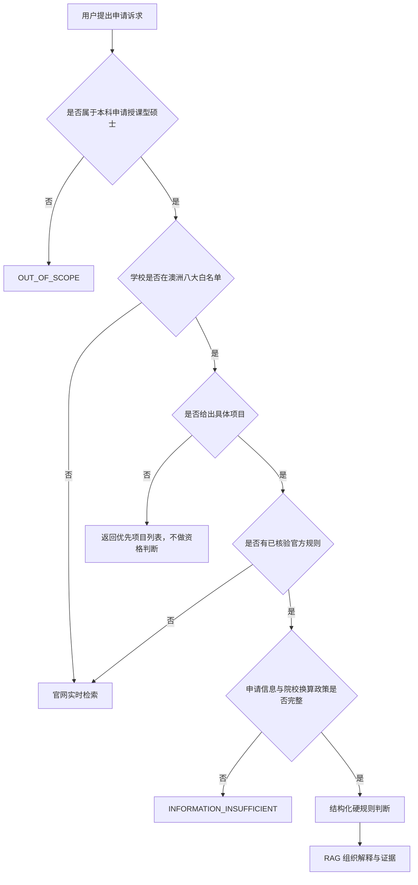

# CampusPilot 录取判断 MVP 规格

## 1. 产品范围

第一版只处理：

- 本科背景申请授课型硕士；
- 学校范围为澳洲八大；
- 计算机与信息技术、商科第一阶段同时开放；
- 工程后续开放。

博士永久排除在当前产品范围外，本科申请本科作为未来扩展。项目目录最终希望覆盖
澳洲八大全部授课型硕士，但当前任何接口都不得宣称目录已经完整。

## 2. 判断边界

核心硬条件是学校按申请人背景给出的 GPA/WAM/百分制门槛。GMAT、GRE、实习和
工作经验只有在官方明确说明能够构成补偿路径时才参与判断。语言班不能补偿 GPA。

系统只能回答“满足已公开最低门槛”，不能回答“保证录取”。第三方参考和历史案例
不能改变官方硬判断。第一阶段不接入历史录取案例。

## 3. 查询状态机



官网实时检索的新规则可以用于当前回答，但默认
`runtime_rule_can_persist=false`。只有人工核验后才能写入正式数据库。

## 4. 结果类型

| 状态 | 含义 |
|---|---|
| `PROJECT_SELECTION_REQUIRED` | 只有学校，没有具体项目 |
| `MEETS_PUBLISHED_MINIMUM` | 满足已公开最低门槛，不代表保证录取 |
| `DOES_NOT_MEET_WITH_OFFICIAL_COMPENSATION` | 不满足分数，但有官方明确补偿路径 |
| `DOES_NOT_MEET_WITH_BRIDGE` | 不满足，但有官方 Pre-Master/桥梁项目 |
| `DOES_NOT_MEET_NO_ALTERNATIVE` | 不满足，未发现官方替代路径 |
| `INFORMATION_INSUFFICIENT` | 缺少成绩口径、院校映射或背景课程 |
| `RELIABLE_REQUIREMENTS_NOT_FOUND` | 项目明确，但没有可靠规则 |
| `OUT_OF_SCOPE` | 博士、本科申请本科或其他非 MVP 场景 |

## 5. 数据分层

### 项目目录

`Program + ProgramVersion + ProgramCatalogProfile` 保存学校、学院、项目、专业类别、
授课型硕士标识、标准学制、intake、官网和发布阶段。

### 硬性规则

`AdmissionCriterion + AdmissionRule` 保存一条录取路径下多组
“申请人背景条件 → 对应成绩门槛”。中国本科院校不能由用户自行选择 985/211/双非，
必须填写具体学校，再匹配目标大学自己的认可名单。

### 替代路径

`AlternativeAdmissionPathway` 单独保存官方分数补偿、工作经验、Pre-Master 和桥梁
项目，并记录额外时长、官方学费和升读条件。普通的多条学历资格 OR 条件不等于
“GPA 不足补偿”。

### 证据来源

`AdmissionEvidence` 保存来源类型、URL、原文、适用年份、抓取/核验时间、证据等级、
审核状态和 `hard_decision_allowed`。只有已核验官方证据允许参与硬判断。

## 6. 在读生成绩目标

精确计算公式：

```text
剩余课程所需平均分
= (目标毕业均分 × 总学分 - 当前均分 × 已修学分) / 剩余学分
```

缺少已修或总学分时只返回粗略目标，并标记 `ESTIMATE_ONLY`。输出始终说明这不是
录取保证。

## 7. API

- `GET /api/admissions/programs`：学校级项目候选，不做资格判断。
- `POST /api/admissions/evaluate`：具体项目确定性硬判断。
- `POST /api/admissions/remaining-average`：在读生剩余课程目标计算。

当前 `OFFICIAL_EQUIVALENT_PERCENT` 是内部规则服务完成官方换算后的成绩口径，不应由
用户自行选择。中国院校映射尚未建成时，原始成绩必须返回信息不足。

## 8. 当前数据完成度

- Monash 2026：39 个项目、67 条录取路径已完成自动抽取；
- 39 份录取文档已切成 159 个子块并写入 `campuspilot_admissions_v1`；
- C6001 的 2 年制与 1.5 年制路径已对照官方课程页核验，可参与硬判断；
- 其余项目处于 `REVIEW_REQUIRED`，可以出现在目录与 RAG 参考中，但不能参与硬判断；
- 中国本科院校认可名单尚未建设，因此用户原始 GPA/WAM 暂不能直接换算。

项目使用 `data/admissions/reviewed_rules.json` 作为核验清单。抓取脚本不会自行把新项目
加入清单，避免“页面抓到了”被误当成“规则已经可以上线”。

## 9. PDF 成绩单扩展接口

`POST /api/admissions/transcripts/parse` 接受最大 10 MB 的 PDF，并保留两种解析提供方：

- `local_pdf`：提取 PDF 文本层；扫描件会要求转 OCR 或多模态解析；
- `multimodal_llm`：可注入的多模态模型适配器，未配置时明确返回不可用。

解析结果始终设置 `requires_user_confirmation=true` 和
`hard_decision_allowed=false`。用户确认学校、课程、学分和成绩后，结构化数据才可进入
院校换算及录取规则服务。原始成绩单不由 RAG 或 LLM 直接生成录取硬结论。
