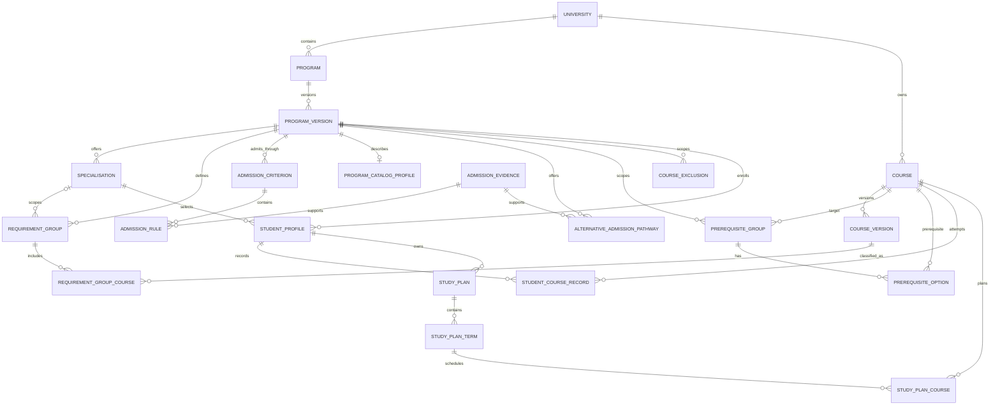

# CampusPilot 领域模型设计

## 1. 设计目标

CampusPilot 当前阶段只解决“数据如何表示”和“规则如何确定性校验”。它不调用大模型，
也不生成自然语言规划。这样可以先回答一个更基础的问题：给定学生、培养方案年份和方向，
系统能否重复得到相同、可解释、可测试的毕业审计结果。

核心边界：

- `Course` 表示课程身份，不保存“必修/选修”；
- `ProgramVersion` 固定某一 Handbook Year 的规则快照；
- `RequirementGroupCourse` 表示课程在某个要求组中的角色；
- RAG 原文是证据来源，结构化规则才参与计算；
- 每个失败结论都返回 `error_code + message + evidence`。

## 2. 聚合与实体

### 学校与培养方案

- `University`：学校身份和官方入口。
- `Program`：跨年份稳定的项目身份，例如 Master of IT。
- `ProgramVersion`：某项目在某 Handbook Year 的规则版本，保存总学分和重复计入上限。
- `Specialisation`：属于某个项目版本的细分方向。方向不能脱离版本单独存在。

### 课程与课程角色

- `Course`：学校内稳定的课程代码和规范名称。
- `CourseVersion`：课程在某一 Handbook Year 的标题、学分和来源证据。
- `RequirementGroup`：项目核心课、方向核心课、限定选修、普通选修、Capstone 等学分桶。
- `RequirementGroupCourse`：课程版本与要求组的关联，并保存当前作用域下的 `role`。

同一 `Course` 可以关联多个要求组，所以 `AI300` 可以在 A 项目中是方向必修，在 B
项目中是限定选修。课程角色属于“课程与培养方案的关系”，不属于课程本身。

### 规则

- `PrerequisiteGroup`：目标课的一组先修要求。
- `PrerequisiteOption`：组内候选先修课。
- `CourseExclusion`：某项目版本和方向中的互斥课程对。

先修表达方式：

```text
组与组之间为 AND
组内 minimum_satisfied=1 表示 OR
组内 minimum_satisfied=N 表示 N-of-M
```

例如 `CPT100 AND (DS110 OR CPT120)`：

- 组 1：`[CPT100]`，至少满足 1 门；
- 组 2：`[DS110, CPT120]`，至少满足 1 门；
- 两组都通过才允许修目标课。

### 学生与方案

- `StudentProfile`：学生当前项目版本和方向。
- `StudentCourseRecord`：已修、在修、计划、挂科、减免、转学分记录。
- `StudyPlan`：一份可比较的学习方案。
- `StudyPlanTerm`：方案中的学期和学分负荷上限。
- `StudyPlanCourse`：某学期计划修读的课程。

状态语义：

| 状态 | 已获学分 | 预计学分 | 先修已完成 |
|---|---:|---:|---:|
| `COMPLETED` | 是 | 是 | 是 |
| `TRANSFERRED` | 按核准值 | 按核准值 | 是 |
| `EXEMPTED` | 按核准值，可为 0 | 按核准值 | 是 |
| `IN_PROGRESS` | 否 | 是 | 当前进度审计中否 |
| `PLANNED` | 否 | 是 | 当前进度审计中否 |
| `FAILED` | 否 | 否 | 否 |

学习方案按 `sequence_number` 排序。校验某学期先修时，只能看到历史已完成课程和更早学期，
不能把同学期课程偷偷当作已经完成。

## 3. 实体关系



## 4. 五个服务接口

### `get_program_requirements`

输入项目版本和方向，返回项目级与方向级要求组、组内课程角色和证据。不存在或跨版本的方向
通过 `DomainLookupError.result` 返回统一错误合同。

### `classify_course_role`

在指定作用域中读取课程关联，可返回一个或多个角色。未进入任何要求组时返回
`NOT_ELIGIBLE + COURSE_NOT_IN_PROGRAM`。

### `check_prerequisites`

逐组计算已完成候选数量是否达到 `minimum_satisfied`，组间执行 AND。每组都保留候选课、
命中课和规则来源。

### `calculate_degree_progress`

课程在项目总学分中只计一次，再分别审计各要求组。服务同时检查：

- 项目总学分；
- 项目与方向必修；
- 选修组最小/最大学分；
- 互斥课程；
- 超过 `max_shared_credits` 的重复组计入。

### `validate_study_plan`

按学期顺序校验学分负荷、重复修课、先修和互斥，再把全部计划课加入预计毕业审计。
某学期失败时不会同时产生“本学期通过”的矛盾结果。

## 5. 扩展边界

- FastAPI：把 Pydantic 响应直接作为 API DTO。
- LangGraph：把五个服务包装为只读确定性工具节点。
- RAG：用 `evidence.source_id/source_url` 找回官方原文并解释规则。
- 数据更新：新 Handbook 只新增 `ProgramVersion/CourseVersion`，旧学生仍绑定旧版本。
- 新规则：可在不改变 Agent 编排的情况下扩展规则表和 `ErrorCode`。

## 6. 录取路径与学制

`AdmissionCriterion` 表示同一个 `ProgramVersion` 下的一条官方录取路径。学校内部的
`Entry Level 1/2/3` 只保留为 `pathway_code`，用户页面展示 `1年制项目`、
`1.5年制项目`、`2年制项目` 等结果语言。

每条路径独立记录：

- 标准学制与需完成学分；
- 最低均分及原文中出现的全部分数阈值；
- 是否要求相关专业背景、荣誉学位或工作经验；
- 数学、统计、编程等具体背景关键词；
- Candidate Statement、GMAT、GRE 等补充材料；
- 替代申请路径和官方证据。

标准学制不等于个人实际就读时间。申请人获得 block credit、RPL 或其他学分减免后，
实际完成时间可能缩短；最终认定仍以学校录取和学分评估结果为准。

录取规则进一步拆成 `AdmissionRule`，从而允许同一项目针对不同中国本科院校名单、
专业背景和成绩口径保存多条条件规则。`AdmissionEvidence.hard_decision_allowed` 是硬
门禁：第三方参考、未审核实时抓取和历史案例都不能参与资格判断。
