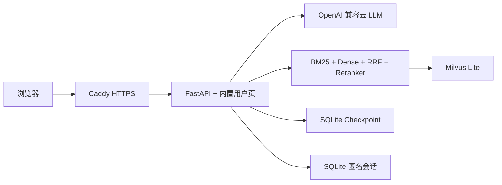

# CampusPilot GitHub 与首版上线方案

## 1. 上线目标

首版目标是“先有一个可公开访问、可回滚、能继续迭代的真实版本”，不把天机学堂全部微服务、
本地 Ollama 和所有离线采集任务同时搬上服务器。

首发拓扑：



首版暂不部署完整天机学堂 Java 微服务。原因不是 Java 无用，而是当前 `tjxt` 仓库包含大量与
CampusPilot 无关的模块和历史敏感配置；直接公开到 GitHub 风险大，运行时也需要 Nacos、MySQL、
Redis、Gateway 和多个 JVM。先用 Python 内置用户页上线，第二阶段再把 `tj-campus`、必要公共模块
和 Vue 前端提取为干净仓库。

## 2. Monash 商科和计算机能上线到什么程度

### 当前真实数据

| 范围 | 唯一项目数 | 录取路径记录 | 可做什么 |
| --- | ---: | ---: | --- |
| Monash 商科 | 21 | 40 | 项目发现、学制与公开门槛检索、RAG 解释、来源展示 |
| Monash 计算机 | 6 | 9 | 项目发现、学制与公开门槛检索、RAG 解释、来源展示 |
| Monash C6001 | 1 | 2 | 在上面基础上增加已核验录取初筛、学分进度、课程角色、4/5/7 学期规划 |

Monash Handbook 语料共有 2,157 个来源，覆盖商科、计算机、工程、数学和物理；整个候选库为
2,139 份 ready 正文、16,797 个检索子块。首版可以同时开放 Monash 商科和计算机的项目咨询，
并且都可以输出带官方来源的规划建议。内部仍记录两种证据强度，但不要求用户先理解技术分层：

- `OFFICIAL_SOURCE_ADVISORY`：根据官方原文生成建议并给来源；
- `RULE_VALIDATED`：在官方原文基础上，由版本化规则引擎完成学分、先修和路径计算。

当前 Monash 商科和计算机项目都可以给出 `OFFICIAL_SOURCE_ADVISORY`；C6001 额外达到
`RULE_VALIDATED`。建议下一条纵向链路选择商科 B6004（Master of
Banking and Finance）或 B6022（Master of Business Analytics），完成课程组、核心课、选修、
开课学期和 Capstone 规则核验。上线时不能把 21 个商科目录项目说成 21 个都能生成毕业方案。

### 首版对用户开放的四条链路

1. **专业与项目推荐**：根据目标、兴趣和背景，从 Monash 商科与计算机目录筛项目；
2. **官方要求问答**：FAQ 仅在高精确匹配时命中，其余进入 Handbook RAG，自然语言回答并给来源；
3. **录取路径比较**：展示 21 个商科、6 个计算机项目的公开路径；只有 C6001 参与硬判断；
4. **学习路径建议**：商科和计算机均可基于官方原文给建议；C6001 还支持成绩单、学分进度、
   课程角色识别和多方案 deterministic planning。

这已经不再是“一条链路”。结构化规则是提高建议可靠性的内部升级，不作为其他项目拒绝回答的门槛。
部署后第一个数据迭代任务仍建议把一个商科项目升级为 `RULE_VALIDATED`。

## 3. GitHub 仓库策略

### 首发只公开 Agent 仓库

建议新建：

```text
campuspilot-agent
```

包含当前 `edurag-agent-lab` 的代码、清洗后的结构化目录、测试、文档、Dockerfile 和 GitHub Actions。
不进入 Git：

- `.env` 和 API Key；
- 模型权重；
- 原始网页和 PDF；
- `handbook-chunks.jsonl` 与 clean 运行语料；
- SQLite 状态数据；
- 日志、缓存、虚拟环境。

### 暂时不要公开镜像完整 `campus-pilot-tjxt`

现有天机学堂仓库的非 CampusPilot 模块包含支付私钥示例。即使删除工作区文件，历史提交仍可能保留
敏感内容。正确处理方式是：

1. 不把原仓库直接设为 public；
2. 创建新的干净仓库，只复制 `tj-campus`、`tj-gateway` 和真正需要的公共模块；
3. 删除支付、交易、旧课程等无关模块；
4. 使用 Gitleaks 扫描新仓库和 Git 历史；
5. 曾真实使用过的密钥必须在服务商处轮换，不能只从代码删除。

第二阶段建议形成：

```text
campuspilot-web       # Vue 用户端
campuspilot-service   # 精简 Spring Boot BFF，可选
campuspilot-agent     # Python Agent、规则与 RAG
```

## 4. 首次推送 GitHub

在 GitHub 创建空仓库后执行：

```powershell
cd D:\agentdev\edurag-agent-lab
git remote add github https://github.com/YOUR_ACCOUNT/campuspilot-agent.git
git push -u github deploy/github-first-release
```

在 GitHub 发起 PR 合并到 `main`。`.github/workflows/ci-container.yml` 会：

1. 安装服务器依赖；
2. 运行部署关键链路测试；
3. 仅在 `main` 或 `v*` 标签构建容器；
4. 推送 `ghcr.io/YOUR_ACCOUNT/campuspilot-agent:latest`、分支、标签和 SHA 镜像。

建议 GHCR Package 首次保持 private。服务器登录：

```bash
echo "$GHCR_TOKEN" | docker login ghcr.io -u YOUR_ACCOUNT --password-stdin
```

Token 只需要 `read:packages`；不要在服务器保存有仓库写权限的个人令牌。

公开页面首次执行保存方案等确认操作时，会调用 `/api/session` 获取匿名 Bearer Token。服务端只在
SQLite 保存 Token 哈希，生产模式不会启用源码中的开发 Token。模型和上传接口使用单进程限流；
当前部署必须保持一个 Uvicorn Worker，多实例时需要把会话和限流迁移到共享存储或网关。

## 5. 准备服务器运行数据

代码镜像不打包模型和完整 Handbook。Windows 开发机执行：

```powershell
cd D:\agentdev\edurag-agent-lab
.\scripts\package_server_runtime_data.ps1 -IncludeModel
```

输出：

```text
deploy/production/runtime-data/
  official_sources/extraction-report.json
  official_sources/handbook-chunks.jsonl
  official_sources/clean/...
  models/all-MiniLM-L6-v2/...
  models/ms-marco-MiniLM-L6-v2/...
  runtime-manifest.json
```

该目录已被 Git 忽略。使用 `scp`、SFTP 或私有对象存储上传到服务器的部署目录。上传后比对
`runtime-manifest.json` 中的 SHA-256，避免 23 MB chunks 文件传输不完整。

## 6. 服务器要求

推荐中国香港或新加坡节点，避免首版备案阻塞。混合检索展示版规格：

- 最低 2 vCPU、4 GB RAM、80 GB SSD，适合单用户或低并发展示；
- 推荐 4 vCPU、8 GB RAM、80 GB 以上 SSD，适合本地 BGE-M3、大型 Reranker 或完整 Vue/Java 服务；
- Ubuntu 22.04/24.04；
- Docker Engine 与 Compose v2；
- 云 LLM API，不在服务器运行 7B 模型。

本机实测 MiniLM + 轻量 CrossEncoder + 16,797 个 BM25 chunks 的 Python 进程约 542 MB；还需为
Milvus Lite、Linux、Caddy、Checkpoint、日志和并发预留空间，因此不建议压到 2 GB 内存。

DNS 将域名 A 记录指向服务器。安全组只开放 22、80、443；8010 不对公网。

### 2026-08-20 低成本购买建议

首发推荐购买 **阿里云轻量应用服务器，中国香港，2 核 4G / 80GB Linux 套餐**，按月购买先验证。
官方公开套餐页当前参考价为 19 美元/月。1 核 2G 虽然能运行 BM25 版本，但不能稳定展示本地
Embedding、Milvus Lite 和 Reranker，不再作为本项目推荐规格。具体地域库存和结算价以下单页为准：
[Alibaba Cloud Simple Application Server Pricing](https://www.alibabacloud.com/en/product/swas/pricing)。

对比项：AWS Lightsail 带 IPv4 的 2GB Linux 套餐为 12 美元/月，4GB 为 24 美元/月，当前没有
价格优势，但账户、监控和全球基础设施更成熟：
[Amazon Lightsail instance bundles](https://docs.aws.amazon.com/lightsail/latest/userguide/amazon-lightsail-bundles.html)。

Oracle Always Free 理论价格最低，但 ARM 配额、区域容量和账户回收不确定，不建议作为公开演示的
唯一服务器。可以作为备份实验机，不能把“免费”当作稳定上线方案。

## 7. 首次启动

服务器：

```bash
mkdir -p /opt/campuspilot
cd /opt/campuspilot
# 上传 deploy/production 下的 Compose、Caddyfile 和 runtime-data
cp .env.production.example .env.production
chmod 600 .env.production
nano .env.production

docker compose --env-file .env.production pull
docker compose --env-file .env.production up -d
docker compose --env-file .env.production ps
docker compose --env-file .env.production logs -f agent
```

首次启动前创建 Milvus Lite 单文件索引。生产构建直接读取已经审核并发布的
`handbook-chunks.jsonl`，不在服务器上重新下载、清洗数百 MB 原始网页：

```bash
mkdir -p runtime-data/vector
docker compose --env-file .env.production run --rm agent \
  python scripts/build_handbook_vector_index.py \
  --chunks-path /app/data/official_sources/handbook-chunks.jsonl \
  --milvus-uri /app/data/vector/campuspilot-handbook.db \
  --collection campuspilot_handbook_v2 \
  --embedder sentence-transformer \
  --model-path /models/all-MiniLM-L6-v2
docker compose --env-file .env.production up -d
```

也可以用专用 CPU 索引镜像离线构建。该镜像将 Torch 固定为 CPU wheel，并固定
`pymilvus 2.5.4` 与 `milvus-lite 2.5.1`，避免 pip 意外打入 CUDA 运行库或跨大版本漂移：

```bash
docker build -f Dockerfile.indexer -t campuspilot-indexer .
docker run --rm \
  -v "$PWD/runtime-data:/runtime" \
  campuspilot-indexer \
  --chunks-path /runtime/official_sources/handbook-chunks.jsonl \
  --milvus-uri /runtime/vector/campuspilot-handbook.db \
  --model-path /runtime/models/all-MiniLM-L6-v2
```

`/health` 应显示 `bm25_sentence_transformer_milvus_rrf_reranked`。向量或重排故障时降级到
全量 BM25，同时在 readiness 和检索诊断中暴露降级原因。

## 8. 上线验收

本地或服务器执行：

```powershell
.\scripts\verify_server_deployment.ps1 -BaseUrl https://YOUR_DOMAIN
```

必须再手工验证：

1. Monash 商科返回 21 个唯一项目范围；
2. Monash 计算机返回 6 个唯一项目范围；
3. “B6022 怎么安排学习路径”能根据官方原文给建议、风险提示和来源，不伪装成学校确认结果；
4. “C6001 没有 IT 背景读几年”命中 96/72 points 证据；
5. C6001 版本化规则引擎返回 4/5/7 学期方案及规划结果；
6. Prompt Injection 用例不能触发越权工具；
7. 删除或损坏 chunks 后 readiness 必须暴露异常，不能静默退回少量样例；
8. API Key 不出现在浏览器 Network、日志和 Git。

## 9. 发布、回滚与备份

发布使用不可变标签：

```powershell
git tag v0.3.0
git push github v0.3.0
```

把服务器 `.env.production` 的镜像从 `latest` 改为 `v0.3.0` 或 SHA。回滚只需改回上一镜像标签并：

```bash
docker compose --env-file .env.production pull agent
docker compose --env-file .env.production up -d agent
```

每天备份：

- `agent_logs` 中的 SQLite Checkpoint；
- `.env.production` 的加密副本；
- `runtime-manifest.json` 与当前镜像 SHA。

不要依赖容器本身保存数据。每次年度 Handbook 更新生成新 chunks、核对 SHA-256、跑回归测试后再替换。

## 10. 部署后的两轮迭代

### 第一轮：增强一条商科建议链路

选择 B6004 或 B6022：

```text
官方项目页和 Course Map
-> 课程组与学分结构化
-> Entry Level/减免路径
-> 核心课、选修、Capstone、开课学期
-> 黄金测试
-> RULE_VALIDATED
-> 建议中同时展示官方来源和 deterministic planning 结果
```

### 第二轮：部署丰富前端

把 Vue 用户端提取到 `campuspilot-web`，让 Caddy 提供静态资源。Java BFF 只有在需要用户系统、
统一认证、审计和企业接口时再加入；个人演示阶段可逐步让 Vue 直接调用 Python 的稳定 `/api` 合同，
减少 Nacos 和 Gateway 的运维成本。
