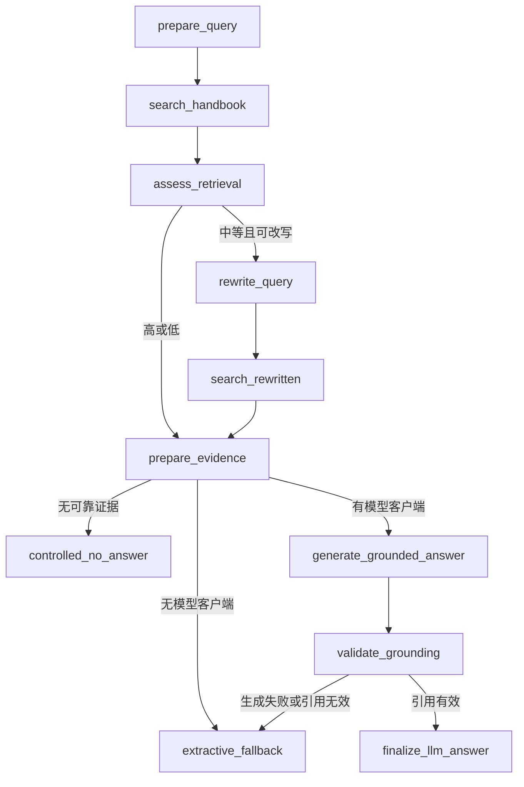
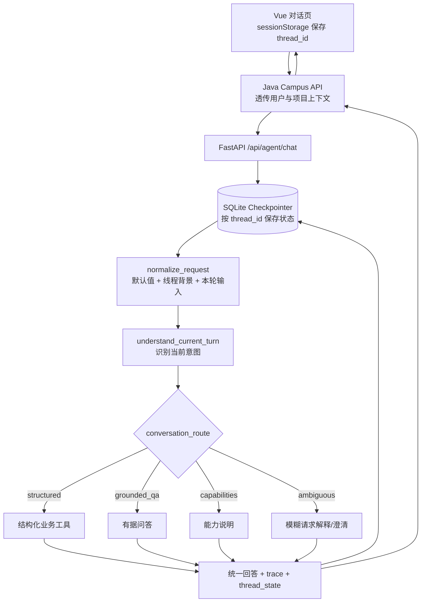
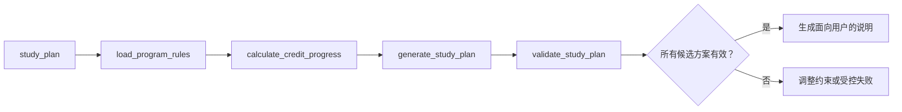
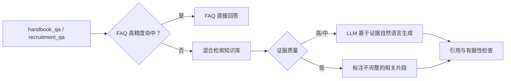

# CampusPilot LangGraph 架构

## Handbook RAG 子图（当前已实现）



这个子图只允许一次查询改写。第二次检索质量不低于第一次才采用，否则保留原查询和原证据。
模型生成后必须包含有效的 `[1]`、`[2]` 证据编号；校验失败时不展示未经约束的模型答案。

## 当前可运行主图



`normalize_request` 的合并顺序是：

```text
产品默认值 < Checkpoint 中已确认的规划背景 < 当前请求
```

当前轮出现明确意图时绝不使用旧意图。只有上一轮正在等待补充字段，或本轮是“那……呢”“再均衡一点”“继续”等短追问时，才允许继承 `last_intent`。这条限制用于防止旧话题污染新问题。

## 结构化规划子图



课程位置、学分、先修、开课学期和 Capstone 顺序由确定性规则计算。LLM 可以解释方案，但不能移动课程或篡改校验结果。

## 有据问答分支



该图表达业务流程；其中 FAQ、检索、生成和校验当前封装在专业 Agent 内，并非全部拆成外层图节点。后续只有在需要独立重试、超时、并行或观测时，才继续拆节点。

## 线程状态边界

Checkpoint 当前只长期保存本线程继续执行所需的数据：

- `planning_context`：项目版本、Handbook Year、方向、已修课、学期容量等；
- `last_intent` 和 `last_course_code`：供受限追问继承；
- `pending_fields`：上一轮还在等待哪些字段；
- `turn_count`：便于联调观察；
- 图执行状态：由 LangGraph Checkpointer 管理。

不同 `thread_id` 完全隔离。当前浏览器使用 `sessionStorage` 保存线程号；生产环境还必须由 Java 服务校验 `thread_id` 的用户归属，不能只相信客户端传值。
