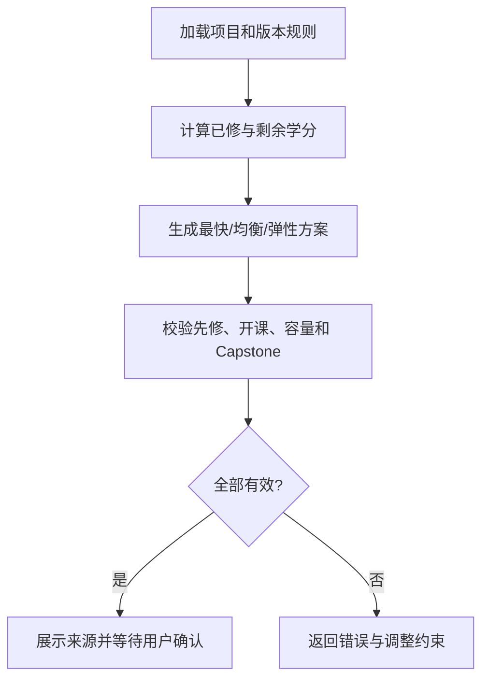

# CampusPilot 技术文档

## 1. 产品目标

CampusPilot 面向澳洲高校留学生，解决三个可演示的真实问题：

1. 比较同一项目不同 Entry Level 的时长、学分和课程结构；
2. 判断一门课在指定项目、方向和培养方案年份中的课程角色；
3. 根据已修课程和单学期负荷生成多套毕业路径，并校验关键约束。

当前已接入 Go8 八校官方目录，并把专业范围收敛为商科、计算机、工程、数学和物理。
商科第一版已覆盖八校 41 个常见授课型硕士项目，其中 Monash 21 个、其余七校 20 个；
项目发现、录取规则审核和课程规划成熟度分别管理，未审核目录不得参与录取硬判断。
Monash University 2026 年 C6001 是首个完成结构化规则和回归验证的项目。系统展示的是
公开资料辅助规划，不替学校做录取、学分认定、选课批准或签证资格判断。

### 1.1 覆盖成熟度

- `official_catalog_connected`：可以浏览和检索官方项目，但不开放自动排课；
- `planning_verified`：课程规则已结构化并通过约束回归，可以生成毕业路径。

这种区分让项目可以先扩展八校目录，同时避免把“有数据”误写成“会规划”。

## 2. 为什么不能只做 RAG

假设用户问：“FIT5120 能否放在下学期？”

RAG 擅长从 Handbook 找到 FIT5120 的描述、开课学期和门槛原文，但仅靠相似文本不能可靠完成：

- 当前用户已经获得多少项目学分；
- 下学期是 S1 还是 S2，对应门槛是多少；
- 前置课程是否完成；
- FIT5120 是否处于最终学期；
- 加入后是否超过用户的单学期负荷。

因此采用双层知识：

| 层 | 保存内容 | 主要职责 |
|---|---|---|
| RAG 证据层 | 官方原文、段落、表格文本、来源 URL | 找资料、解释、引用、回答开放问题 |
| 结构规则层 | 学分、角色、先修、开课学期、版本和适用范围 | 计算、约束校验、生成可执行计划 |

普通单元测试使用轻量假实现，保证测试不依赖外部服务；Linux 展示环境已完成真实
Handbook 混合检索建库。2,139 份通过质量门禁的正文按标题层级生成 16,035 个父块和
16,797 个子块，子块同时进入 BM25 与 MiniLM/Milvus Lite 召回。两路结果先经 RRF
融合，CrossEncoder Reranker 再完整重排有限的 RRF 候选前缀，最后按 `parent_id` 去重并
返回父块作为生成上下文。开发环境仍可切换到 BGE-M3。

检索前可按 `university_id`、`program_code`、`discipline_id` 和
`handbook_year` 过滤，防止相同课程术语在不同学校或培养方案年份之间串用。

规则计算基于版本化结构数据。模型负责理解用户目标和解释结果，deterministic planning 由规则引擎完成。

## 3. 数据模型

### 3.1 项目变体

同一 `program_code=C6001` 下拆分：

- `MONASH-C6001-EL1`：96 学分，2 年；
- `MONASH-C6001-EL2`：72 学分，1.5 年，具有 24 学分入学减免语义。

Entry Level 由学校基于申请背景评估，不是用户自由切换的套餐。

### 3.2 课程规则作用域

课程自身属性与课程在培养方案中的角色分开：

```text
course:
  course_code, credit_points, prerequisites, offerings

program_course_rule:
  program_variant_id, handbook_year, study_stream,
  course_code, rule_type, credit_group
```

同一门课可在 Industry Experience 中是 `CAPSTONE`，在 Research 中是 `NOT_ELIGIBLE`。

## 4. Agent 工作流



每个节点都写入 `trace`，用于回答“调用了什么、在哪一步失败、为什么降级”。当前规划工具包括：

- `get_program_rules`
- `search_official_evidence`
- `calculate_credit_progress`
- `generate_study_plan`
- `validate_study_plan`

## 5. 官方资料更新

### 5.1 版本键

任何结论都必须携带 `source_id`、`handbook_year`、`effective_date`、`retrieved_at` 和内容哈希。
新旧年份并存，历史用户继续按其入学年份使用旧培养方案。

### 5.2 发布流水线

```text
定时检测内容哈希
-> 新内容进入 staging
-> 文档解析与规则差异报告
-> 审核高风险字段
-> 建立新的 RAG 索引与规则快照
-> 跑黄金集和约束回归
-> 原子发布 catalog_version
-> 保留旧版本以便回滚
```

高风险字段包括学分总量、课程角色、先修条件、开课学期、项目时长和政策生效日期。
不能让 LLM 看到网页变化后直接改生产数据库。

### 5.3 失败语义

- `403/429`：抓取渠道受限，不代表资料被删除；
- 网络超时：有限重试，仍失败则保留上次成功版本并标记陈旧；
- 内容变化：暂存等待审核，不自动覆盖；
- 解析失败：原文可进入隔离区，但结构规则不可发布；
- 回归失败：整个新版本不切换。

## 6. 服务与集成边界

- FastAPI：产品 API、规划编排和用户确认；
- LangGraph：显式状态流、Interrupt 和 Checkpoint；
- Java Gateway：对接现有 Java 组织的薄适配层，不复制 Agent 逻辑；
- Dify：适合低代码编排、运营配置和快速接渠道，核心规则仍调用后端 API；
- Milvus Lite/BM25/MiniLM：低成本部署的原文混合召回链路；CrossEncoder Reranker
  作为第三路排名信号，开发环境可切换 BGE-M3；
- MySQL/Redis：结构化业务数据、FAQ、缓存和任务状态；
- SQLite：当前本地演示 Checkpoint。

## 7. 用户确认

检索和计划草案不需要审批。保存或覆盖方案、发送邮件、写入长期偏好等有副作用操作需要：

```text
生成预览 -> Interrupt 暂停 -> 用户确认/修改/拒绝
-> Checkpoint 恢复 -> 幂等执行
```

关闭确认框按拒绝处理，不能让待执行任务长期悬空。

## 8. 测试策略

- 单元测试：课程角色、Entry Level、先修、Capstone 和学分计算；
- API 测试：目录、比较、分类和计划接口；
- 工作流测试：Interrupt、恢复、线程归属和防重复执行；
- 可靠性测试：Deadline、动态 Timeout、有限重试和缓存降级；
- 安全测试：越权访问与间接 Prompt Injection；
- 前端测试：桌面和移动端布局、三条主流程、保存确认；
- 更新测试：哈希变化、抓取失败、暂存路径和非自动发布。

## 9. 已知边界

当前版本只公开演示一个学校的一个项目，不代表数据模型只能支持一个学校。扩展顺序应是：

1. 增加学校适配器和官方来源清单；
2. 建立统一课程与培养方案 Schema；
3. 为每所学校增加解析器和黄金回归集；
4. 数据质量达标后才开放对应学校。

Neo4j 适合后续表达跨课程的复杂依赖和可解释路径，但当前先修关系可用结构表和 DAG 解决，
不应为了技术栈而引入额外部署负担。

## 学期建议 Agent 与课程展示

课程角色、学分、先修、开课学期和计划有效性由确定性规则引擎负责。前端课程项
同时展示课程类型色条、规划负载和考试状态；考试资料缺失时明确标记“待核实”。

学期解释采用按需调用：

```text
展开学期
  -> Java 根据数据库 ID 解析可信项目上下文
  -> Python 重新生成并校验方案
  -> 选择 plan_id 和 semester
  -> Ollama JSON Schema 生成
  -> Pydantic 与有据性门禁
  -> 前端缓存并展示
```

当前本地演示模型为 `qwen3.5:2b-q4_K_M`。0.8B 仅保留为流程实验模型，不用于
学期建议展示。
