# LangGraph Flow

## CampusPilot Handbook 有据问答

当前 Handbook 问答不再是一个不可见的“检索后生成”函数，而是独立子图：

`prepare_query -> search_handbook -> assess_retrieval -> [rewrite once] -> prepare_evidence -> generate -> validate -> finalize/fallback`

关键状态包括 `documents`、`retrieval_quality`、`effective_query`、`retry_count`、
`evidence`、`generated_content`、`grounding_valid` 和 `trace`。检索客户端与模型客户端留在
Agent 实例中，不写入 state，避免 Checkpoint 序列化外部连接对象。

## CampusPilot 对话主图

CampusPilot 现在采用两层 LangGraph。外层对话主图负责识别当前轮动作并选择业务路径，内层学习规划图负责加载规则、计算学分、生成候选方案和确定性校验。

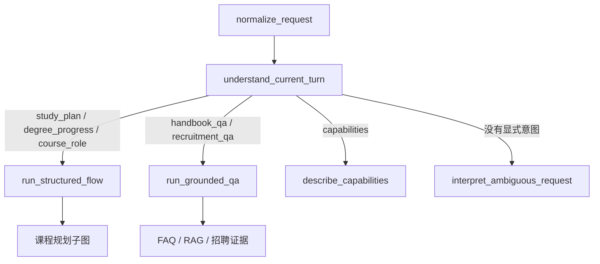

显式意图进入图后会被锁定。例如“我想参加 2028 年秋招，推荐我怎么安排”同时包含招聘场景和规划动作，主图将其锁定为 `study_plan`。LLM 可以提取目标年份、解释方案取舍，但不能把它改成单纯的招聘公告查询。只有“继续”“那我呢”这类当前轮信息不足的请求，才进入模糊意图解释节点并结合对话历史。

## Current Graph

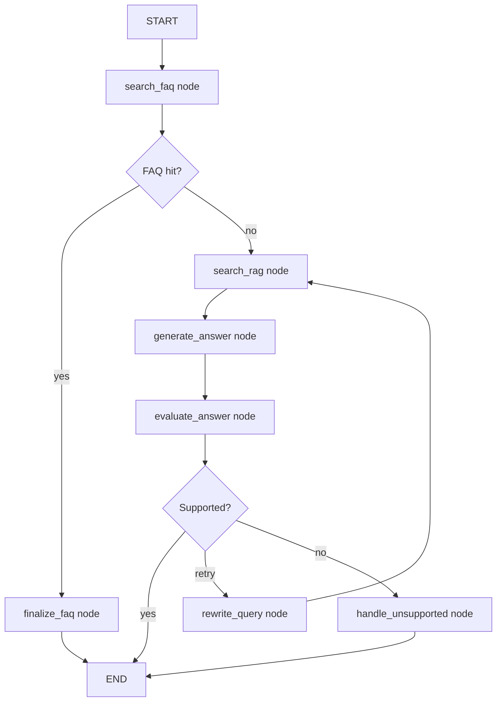

## State

The graph passes one state object between nodes:

```python
{
    "query": "...",
    "source_filter": "ai",
    "faq_result": {...},
    "rag_result": {...},
    "answer": "...",
    "answer_source": "faq | rag_generated | no_answer",
    "documents": [...],
    "confidence": "high | medium | low",
    "retry_count": 0,
    "original_query": "...",
    "effective_query": "...",
    "evaluation": {
        "supported": true,
        "support_score": 0.42,
        "reason": "...",
        "evaluator": "rule_based"
    },
    "next_action": "answer_user | ask_clarification_or_create_ticket",
    "trace": [...]
}
```

## How To Understand LangGraph

LangGraph is not mainly about calling a model. It is about controlling an
Agent's stateful workflow.

In a normal Python function, the flow is hidden inside code:

```text
if FAQ hit:
    return answer
else:
    call RAG
```

In LangGraph, the flow is explicit:

- each node has one job
- state is passed between nodes
- branches are declared as edges
- later we can add retry, memory, critic, human review, and multi-agent routes

## Why This Project Needs It

EduRAG starts as a fixed RAG pipeline:

```text
FAQ -> RAG -> LLM
```

An Agent version needs room for decisions:

- Should we answer from FAQ?
- Should we search RAG?
- Should we ask a clarification question?
- Should we call a backend tool?
- Should we evaluate whether the answer is grounded?
- Should we create a ticket when no answer exists?

LangGraph gives us a clean place to add these decisions without turning one
large function into an unreadable chain of `if/else`.

## Design Answer

LangGraph is useful when an Agent workflow has multiple steps, branches, memory,
or retries. Compared with a single chain or ordinary function, it makes the
state and control flow explicit. In this project, FAQ search and RAG search are
separate nodes, and the graph conditionally routes to RAG only when FAQ misses.
Later, the same graph can add answer evaluation, human review, MCP tools, and
multi-agent collaboration.

## Current Learning Milestone

We now have one more node:

```text
search_rag -> generate_answer
generate_answer -> evaluate_answer
```

This `generate_answer` node does not call a real LLM yet. It synthesizes a
development answer from retrieved documents. This keeps the graph runnable even
without a valid DashScope/Ollama model, while preserving the place where a real
LLM node will be inserted later.

The `evaluate_answer` node performs a lightweight support check. It is not a
real judge model yet. It checks whether the generated answer has enough lexical
overlap with retrieved documents and lowers confidence when there is no evidence.

After evaluation, the graph branches:

```text
supported -> END
unsupported and retry_count < 1 -> rewrite_query -> search_rag
unsupported and retry_count >= 1 -> handle_unsupported -> END
```

This is the first real decision loop shape in the project. A weak answer is no
longer returned as if it were reliable. The graph switches to a fallback answer
and sets `next_action` to `ask_clarification_or_create_ticket`.

The retry loop is capped by `retry_count`, so the graph cannot keep rewriting
forever.

## Human Approval Pause/Resume Flow

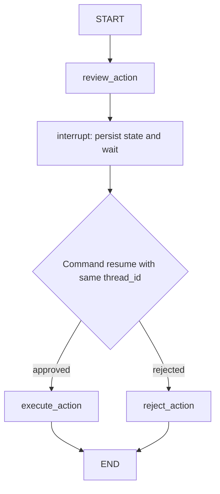

The approval graph is compiled with a checkpointer. `thread_id` identifies the
saved execution state. The first run pauses inside `review_action`; a later
request resumes it with `Command(resume=True|False)`.

Important rules:

- Do not hold an HTTP request open while waiting for a person.
- Use a durable checkpointer in production; `MemorySaver` is process-local.
- Resume with the same `thread_id`.
- Treat `thread_id` as a state cursor, not an authorization credential.
- A node restarts from its beginning after resume, so side effects before
  `interrupt()` must be avoided or idempotent.
- Do not rename or remove nodes while production threads are paused without a
  migration plan.

## Memory Scope

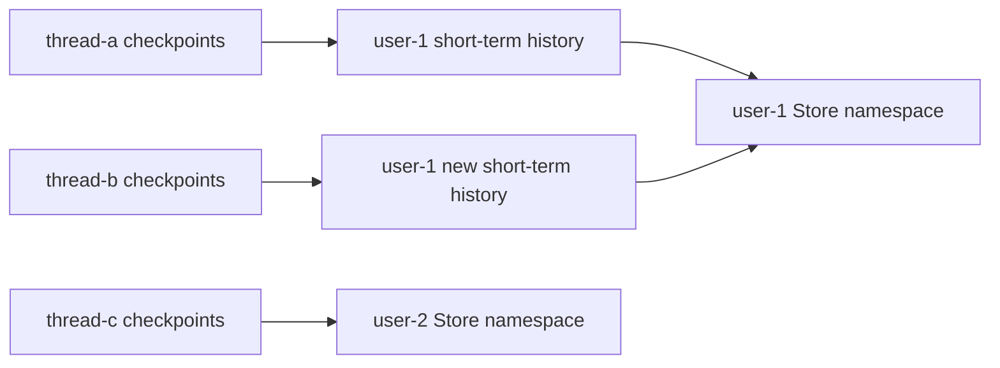

Checkpoint state is scoped by `thread_id`. Long-term memory is scoped by a
separate namespace such as `(user_id, "preferences")`. A new thread must not
inherit the old thread's entire message history, but it may retrieve selected
long-term preferences for the same authenticated user.

Before writing to the long-term Store, candidates pass through a memory policy:

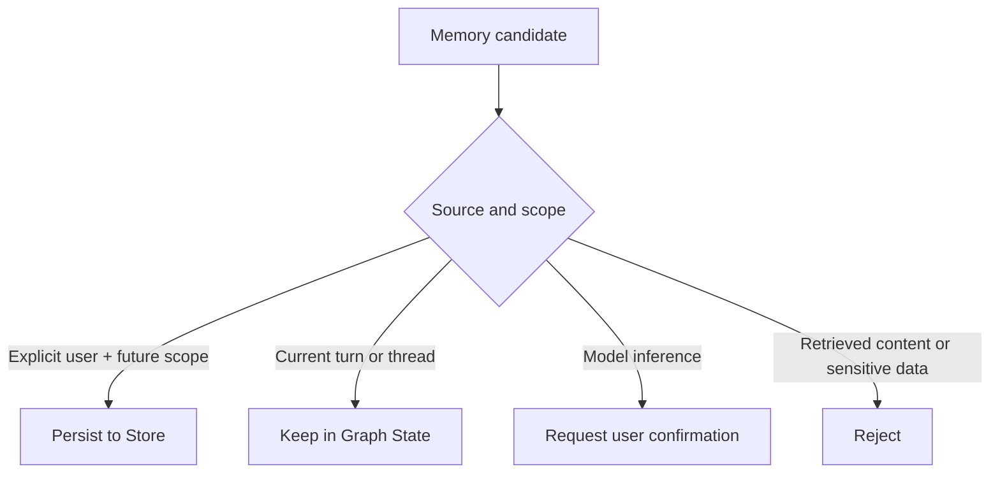

When reading preferences, the effective value follows:

```text
system and permission constraints
  > current-turn instruction
  > thread preference
  > long-term memory
  > product default
```

Current-turn overrides are temporary. They do not update the long-term Store
unless the user explicitly asks for future conversations to change.

Long-term memory recall follows:

```text
authenticated user namespace
  -> scope and trust filters
  -> minimum relevance filter
  -> relevance/importance/confidence/recency ranking
  -> Token-budget packing
  -> preference precedence resolution
  -> prompt assembly
```

Filtering must happen before semantic ranking. An expired or unauthorized
memory must never enter the prompt merely because it has a high similarity
score.

Long-term memory writes also pass through consolidation:

```text
write policy accepted candidate
  -> find active memory by authenticated user_id + key
  -> same value: ignore duplicate
  -> explicit new value: supersede old version
  -> conflicting model inference: require confirmation
  -> retrieval reads active versions only
```

Superseded records remain available for audit but do not enter the prompt.
Production storage must enforce at most one active version for each user and
memory key.

## State Data Boundaries

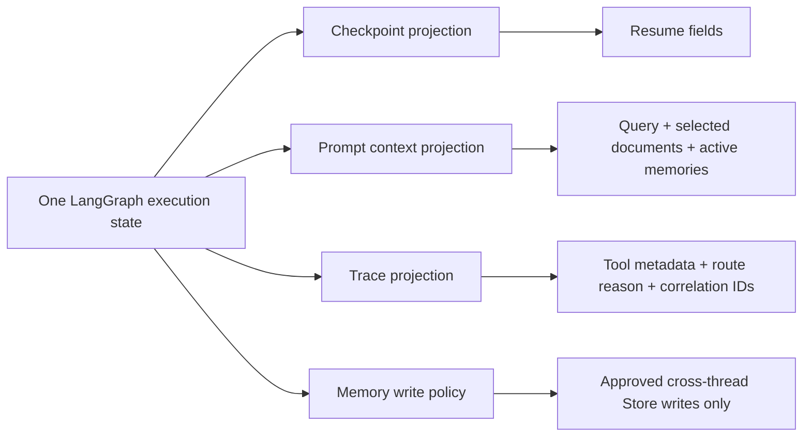

Each output uses an explicit allowlist. Tool payloads and trace details are not
automatically placed in the prompt or long-term Store.

## Safe Context Preparation

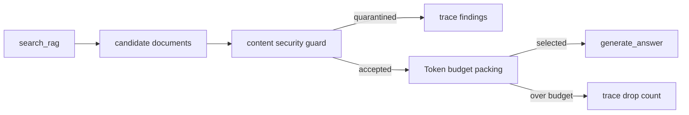

`generate_answer` reads only the selected `documents` field, not the raw
`rag_result`. This prevents quarantined or over-budget content from reaching the
model through an alternate path.

## Memory And RAG Budget

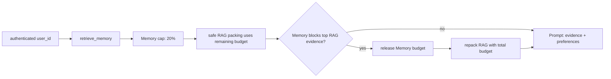

Long-term Memory is labeled as personalization context and cannot be treated as
domain evidence. Missing authenticated identity skips Memory retrieval.

When the initial Memory selection blocks the top factual document, the graph
uses evidence-first residual packing:

```text
release initial Memory selection
  -> pack RAG with the total budget
  -> calculate residual tokens
  -> repack only hard-filtered eligible Memory
  -> assemble evidence and personalization sections
```

This turns the Day 27 fallback from `RAG A only` into `RAG A + Memory M2` when
M2 exactly fits the residual budget.

## End-to-End Deadline

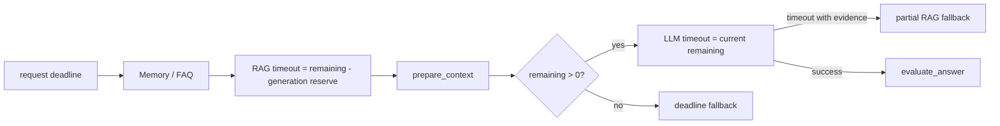

The monotonic deadline is request-local. A durable human-approval resume creates
a new request budget instead of reusing a process-local monotonic timestamp.

## CampusPilot Study Planning

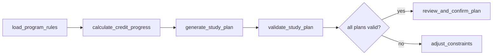

`generate_study_plan` creates fastest, balanced, and flexible candidates.
`validate_study_plan` independently checks prerequisite order, semester
offerings, semester capacity, credit coverage, and final-semester Capstone
placement. Candidate generation cannot mark its own output as valid.

## CampusPilot Conversation Router

当前外层对话图已经使用结构化意图解析，不再由一个隐藏的 `if/else`
同时承担语言理解、结果校验和业务路由：

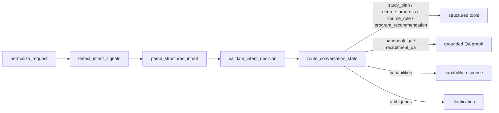

`parse_structured_intent` 使用 Pydantic `IntentDecision` 校验模型 JSON。课程代码
必须出现在用户原文中；低于 `0.55` 的结果、非法字段和模型超时都会退回确定性
候选信号。解析结果由外层图传给业务 Agent，同一轮不会重复调用意图模型。

混合检索允许通道级降级：Milvus 不可用或集合恢复时，Dense 通道记录
`dense_error`，BM25 继续返回证据，`search_official_evidence.degraded=true`。

专业推荐分支不要求已有 `program_variant_id`。它先提取就业、兴趣和性格偏好，再从
官方项目目录检索候选并确定性排序：

```mermaid
flowchart LR
    A["program_recommendation"] --> B["extract_recommendation_profile"]
    B --> X{"rules found profile?"}
    X -- "yes" --> C["search_verified_program_catalog"]
    X -- "first insufficient turn" --> Q["ask one clarification and persist pending field"]
    Q --> R["user profile reply"]
    R --> L["recommend_program_directions_with_agent"]
    L --> C
    C --> D["rank_program_candidates"]
    C --> U["direction_only when catalog misses"]
    D --> I["explain_profile_inference"]
    I --> J["build_career_path"]
    J --> N["generate_natural_recommendation"]
    N --> E["return natural advice, career path and official links"]
    E --> F["user selects a program"]
    F --> G["admission rule evaluation"]
    U --> V["show unindexed direction cards and verification notice"]
```

推荐只负责缩小候选范围；GPA/WAM 换算和录取门槛仍由后续规则服务判断。
明确方向词走规则快速路径；没有明确方向时直接调用专业方向 Agent。Agent 可以根据收入
目标、兴趣、能力和工作强度偏好推荐 0 到 3 个受控方向，但不能生成具体大学项目。随后
仍由已核验项目目录提供候选事实。外层意图是否来自当前轮或继承线程，不再决定是否允许
调用方向 Agent，避免第二轮重新识别到 `program_recommendation` 后反而跳过 Agent。

目录外方向不会被当作澄清失败。`direction_only` 分支允许 Agent 给出方向候选，但不生成
学校项目、职业代码、邀请分数或签证路径；前端使用“项目详情待收录”卡片单独展示。

项目目录完成后，`generate_natural_recommendation` 根据受控方向、可探索岗位和准备建议
自由生成 Pia 的自然语言回答。学校与项目事实仍由目录卡片负责展示；生成内容若出现无证据
的录取、薪资、签证或移民结论，会先重写一次，再失败才回退确定性摘要。

后续轮次不会重复首轮“可以先不选专业”的介绍，而是承接已知兴趣继续追问。模型推断必须
同时提供用户原话证据和公开解释；服务层把内部英文标签转换为中文展示。候选项目还会附带
可探索岗位与准备步骤，把“推荐专业”继续推进到可验证的职业探索路线。

当前两层图、线程 Checkpoint 和状态边界的完整版本见
[`CAMPUSPILOT_LANGGRAPH_ARCHITECTURE.md`](CAMPUSPILOT_LANGGRAPH_ARCHITECTURE.md)。

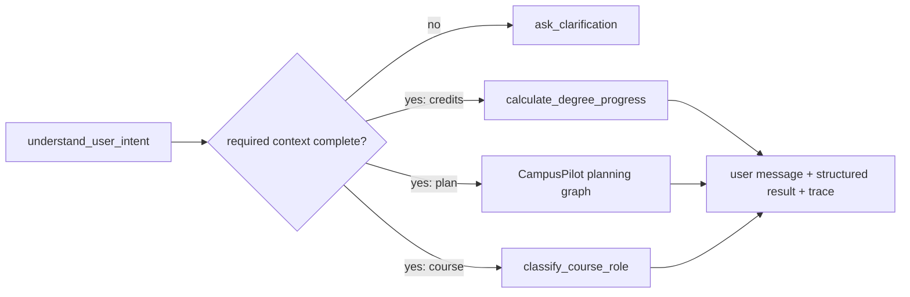

The conversation router is currently deterministic. The study-plan branch
enters the existing LangGraph workflow. A later LLM intent parser must produce
validated structured output and fall back to this router when parsing fails.
