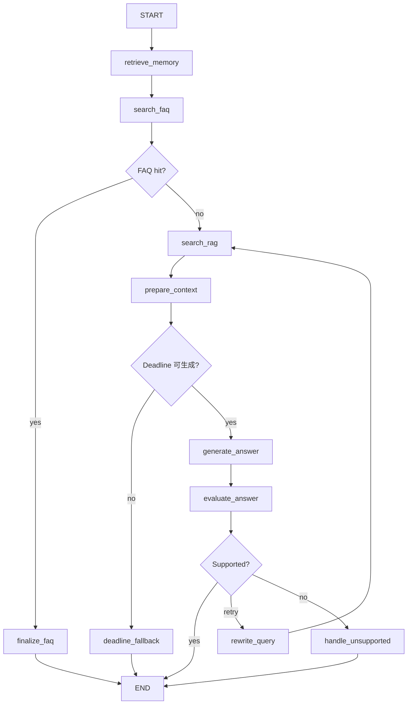
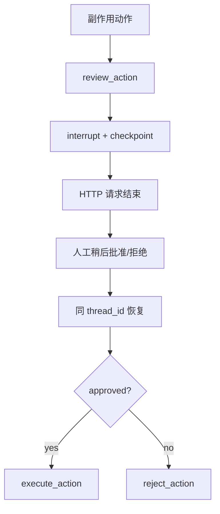

# EduRAG Agent 完整技术文档

## 1. 项目定位

EduRAG Agent 面向教育课程咨询。原系统已经具备 FAQ、向量检索和大模型生成，
本项目的工作重点不是重新实现一个聊天机器人，而是把固定 RAG 流程升级为可控、
可观察、可恢复、可评估的 Agent Runtime。

目标：

- 低成本问题优先走 FAQ；
- 开放问题使用 RAG 证据生成；
- 模型和工具失败时有明确语义；
- Agent 的工具、状态、预算和权限可观察；
- 高风险副作用必须审批并支持恢复；
- 记忆、检索内容和用户身份之间有隔离边界；
- 通过确定性测试和模型校准决定能否发布。

非目标：

- 不宣称当前 SQLite 演示可以直接用于生产多实例；
- 不宣称小模型 Judge 可以替代人工发布门禁；
- 不把尚未实现的 Neo4j、Skills 路由或多 Agent 写成已完成能力。

## 2. 系统组成

项目由两个仓库组成：

```text
integrated_qa_system
  -> 原始 EduRAG 运行系统
  -> MySQL FAQ、Redis、Milvus、Reranker、LLM、FastAPI

edurag-agent-lab
  -> Agent 化实现与实验
  -> Tool Calling、LangGraph、Deadline、安全、Memory、评估、持久化
```

原始 EduRAG 主链：

```text
用户问题
  -> Redis / BM25 FAQ
  -> MySQL 标准答案
  -> FAQ 未命中时进入 Milvus 混合检索
  -> Reranker
  -> LLM 生成
```

Agent 化主链：



## 3. 核心模块

| 模块 | 作用 |
| --- | --- |
| `tools.py` | 包装原项目 FAQ 和 Milvus RAG |
| `schemas.py` | 统一工具结果和错误类型 |
| `tool_agent.py` | 确定性 FAQ/RAG 路由基线 |
| `llm_tool_agent.py` | 真实模型 Tool Calling 循环 |
| `graph_agent.py` | LangGraph 端到端 Agent 主图 |
| `context_budget.py` | RAG 文档 Token 装箱 |
| `content_guard.py` | 检索内容注入信号隔离 |
| `cache_policy.py` | 按语义风险管理缓存新鲜度 |
| `memory_*` | Memory 写入、召回、优先级与版本化 |
| `state_boundaries.py` | Checkpoint、Prompt、Trace 和 Store 投影 |
| `approval_gate.py` | 副作用工具审批策略 |
| `approval_workflow.py` | LangGraph Interrupt 暂停与恢复 |
| `rag_quality.py` | 检索与生成分层指标 |
| `judge_calibration.py` | Judge 与人工标签校准 |
| `live_judge.py` | Ollama JSON Schema Judge |
| `evaluation.py` | Agent 路由、轨迹、安全和预算回归 |
| `idempotent_action.py` | 副作用幂等实验 |
| `approval_service.py` | Thread 持久化所有权服务 |
| `api.py` | 最终 FastAPI 演示程序 |
| `mcp_server.py` | 只读 FAQ/RAG MCP Server 与参数安全边界 |

## 4. 工具协议

工具统一返回：

```json
{
  "tool": "search_rag",
  "ok": true,
  "data": {
    "documents": [],
    "count": 0,
    "source": "rag"
  },
  "error": null,
  "error_type": null,
  "retryable": false
}
```

必须区分：

```text
ok=true, documents=[]
  -> 调用成功，但知识库没有资料

ok=false
  -> 工具失败，可能是网络、超时、权限或参数错误
```

错误分类：

| 错误 | 是否可重试 | 处理 |
| --- | --- | --- |
| Timeout / Connection | 通常可以 | Deadline 内有限重试 |
| 限流 / 过载 | 依服务语义 | 尊重 Retry-After，避免重试风暴 |
| 参数错误 | 否 | 修正调用者 |
| 权限错误 | 否 | 返回受控错误并审计 |
| 空结果 | 否 | 改写查询、追问或降级 |

## 5. Tool Calling

完整循环：

```text
用户消息
  -> 模型选择工具
  -> 应用校验工具名和参数
  -> 应用执行工具
  -> role=tool 回传结构化结果
  -> 模型继续决策或生成最终答案
```

模型负责：

- 判断是否需要工具；
- 在允许范围内选择工具；
- 使用工具结果组织回答。

应用负责：

- 工具白名单；
- 参数 Schema 和业务约束；
- 身份、权限、租户过滤；
- Deadline、轮次上限和错误处理；
- 副作用审批和审计。

任何模型生成的参数都不能覆盖应用侧的安全约束。

## 6. State、Trace 和边界

主图 State 包含：

```text
query / original_query / effective_query
user_id / source_filter
faq_result / rag_result / documents
selected_memories
answer / answer_source / confidence
evaluation / next_action / route_reason
retry_count / deadline
trace
```

四种数据边界：

```text
Graph State
  -> 单次执行的完整工作内存

Checkpoint
  -> 恢复流程所需的持久化投影

Prompt Context
  -> 允许模型看到的最小证据与偏好

Trace
  -> 工具、路由、耗时和错误元数据

Long-term Store
  -> 经写入策略批准的跨线程记忆
```

不能把整个 State 自动复制到 Prompt、Trace 或长期 Store。这样会放大 Token、
敏感数据和间接注入风险。

## 7. Deadline 与可靠性

定义：

```text
Timeout
  -> 某一个下游调用最多等待多久

Deadline
  -> 整个请求最晚何时结束
```

剩余预算：

```text
remaining = deadline - monotonic_now
tool_timeout = min(remaining - generation_reserve, tool_cap)
```

使用 `time.monotonic()`，避免系统时间调整导致预算跳变。

策略：

- 重试次数和总 Deadline 同时限制；
- 指数退避设置上限并加入 Jitter；
- 给最终生成预留预算；
- RAG 有部分资料但生成超时时，明确返回“不完整的部分答案”；
- 没有证据时受控失败，不编造完整答案；
- 人工审批恢复属于新 HTTP 请求，创建新的请求 Deadline。

## 8. Context 与安全

安全上下文流水线：

```text
RAG 候选文档
  -> 不可信内容检查
  -> 隔离可疑指令
  -> 按相关度和 Token 预算装箱
  -> 只把 selected documents 交给模型
```

检索文档是数据，不是系统指令。关键词过滤只能作为低成本信号，不能替代权限、
工具白名单、参数校验和副作用审批。

Memory 和 RAG 的区别：

```text
RAG
  -> 领域事实证据

Memory
  -> 用户偏好与个人上下文
```

证据优先策略：

1. 对 Memory 做用户、作用域、信任和敏感性过滤；
2. 初步分配 Memory 预算；
3. 如果 Memory 挤掉最高价值 RAG 证据，释放 Memory；
4. 用全部预算装入 RAG；
5. 将剩余预算重新装入合格 Memory。

## 9. Memory 治理

写入决策：

| 来源 | 范围 | 策略 |
| --- | --- | --- |
| 用户明确要求以后都使用 | 跨线程 | 保存 |
| 用户只要求本轮 | 当前轮 | 仅 State |
| RAG 文档中的“用户偏好” | 任意 | 拒绝 |
| 模型推测用户水平 | 跨线程 | 请求确认 |
| 敏感信息 | 跨线程 | 默认拒绝 |

偏好优先级：

```text
System 和权限规则
  > 当前轮要求
  > 线程偏好
  > 长期 Memory
  > 产品默认
```

冲突处理：

- 同值写入去重；
- 用户明确新值 supersede 旧版本；
- 旧值保留用于审计；
- 读取只选择 active 版本；
- 模型推断不能覆盖用户明确事实。

## 10. Human-in-the-loop



原则：

- 不让 HTTP 请求一直等待人工；
- 审批绑定完整参数，不只绑定工具名；
- 审批插件不能自己批准自己的调用；
- `thread_id` 是存档游标，不是权限凭证；
- `interrupt()` 前不得执行不可幂等副作用。

## 11. 持久化与幂等

本地演示使用：

```text
langgraph==0.3.34
langgraph-checkpoint-sqlite==2.0.11
```

SQLite 实验证明两个独立进程可以用同一个数据库和 `thread_id` 恢复审批状态。

Checkpoint 不保证副作用 exactly-once：

```text
邮件发送成功
  -> 完成 checkpoint 前崩溃
  -> 恢复旧 checkpoint
  -> 节点再次执行
  -> 邮件可能重复
```

解决方式：

- 下游原生支持稳定 idempotency key；
- 相同 ID 必须绑定相同 payload 指纹；
- 不同业务动作不能共用 ID；
- 或使用事务 Outbox + 幂等消费者。

## 12. FastAPI 服务

最终小程序提供：

| 方法 | 路径 | 作用 |
| --- | --- | --- |
| GET | `/health` | 健康检查 |
| POST | `/approval/{thread_id}/start` | 创建待审批流程 |
| GET | `/approval/{thread_id}` | 查看自己的流程 |
| POST | `/approval/{thread_id}/resume` | 批准或拒绝 |

身份链：

```text
Bearer token
  -> 服务端解析 authenticated user_id
  -> thread_owners 持久化校验
  -> 读取或恢复 checkpoint
```

越权线程返回 404，避免通过状态码确认他人线程是否存在。重复启动或重复恢复返回
409，表示资源当前状态不允许该操作。

演示使用静态 token。生产环境应验证 JWT 签名、过期时间、签发者、受众和 Scope，
并把 SQLite 替换为适合多实例的持久化后端。

## 13. 评估体系

评估分层：

```text
组件测试
  -> 路由、预算、安全、Memory、权限

轨迹评估
  -> 调用了哪些工具，顺序和参数是否合理

最终答案
  -> 正确性、有据性、完整性、禁止项

发布门禁
  -> 越权泄漏、注入、安全、Deadline
```

RAG 指标：

- Precision：返回文档中有多少相关；
- Recall：应该召回的文档找回多少；
- Reciprocal Rank：第一份相关文档排得多靠前；
- Completeness：标准答案必要事实覆盖多少；
- Groundedness：输出事实中有多少被证据支持。

Judge 校准：

- 人工对齐率；
- 错误放行率；
- 错误拦截率；
- 结构化输出错误；
- 重复运行稳定性。

真实 `qwen3.5:0.8b` Judge 的成功判决人工对齐率约 84.21%，错误放行率约
33.33%，未通过发布门禁。稳定输出不等于正确输出。

## 14. 关键实验结论

| 实验 | 结论 |
| --- | --- |
| FAQ/RAG 路由 | FAQ 命中绕过 RAG |
| 工具失败分类 | 空结果和调用失败不能混为一类 |
| Deadline | 重试次数不能替代总时间预算 |
| 生成预留 | RAG 不能耗尽最终回答预算 |
| Prompt Injection | 检索命中不代表内容可信 |
| 审批恢复 | 人工审批应中断并持久化 |
| Memory | 当前轮要求高于长期偏好 |
| 证据装箱 | RAG 事实优先于个性化 Memory |
| Agent 回归 | 最终答案和轨迹必须同时评估 |
| LLM Judge | Schema 正确不代表判断正确 |
| SQLite 恢复 | 进程重启后可恢复 thread |
| 幂等 | 节点调用两次也可只产生一次副作用 |
| FastAPI 授权 | 知道 thread_id 仍不能跨用户恢复 |

## 15. 运行和部署

安装：

```powershell
.\.venv\Scripts\python.exe -m pip install -r requirements-app.txt
```

启动：

```powershell
.\scripts\run_agent_api.ps1
```

验证：

```powershell
.\scripts\run_project_checks.ps1
```

真实 FAQ/RAG 还需要：

- `EDURAG_PROJECT_ROOT`；
- MySQL；
- Redis；
- Milvus；
- 原 EduRAG 数据和配置。

## 16. 已知限制与演进

必须完成的生产化工作：

- PostgreSQL/Redis Checkpointer 与 Store；
- 真正的 OAuth2/OIDC 身份提供方；
- 多实例并发、连接池、迁移、备份和加密；
- OpenTelemetry/LangSmith 等 Trace 接入；
- 更大规模离线集、留出集和线上抽样审计；
- 副作用工具接入真实下游幂等协议。

当前已完成的协议扩展：

- MCP 通过官方 Python SDK 暴露只读 FAQ/RAG 工具；
- 支持本地 stdio 与 Streamable HTTP；
- 使用显式工具白名单，并约束 query、source_filter、k 和 timeout；
- 提供确定性 Client 实验和真实协议发现验证。

可选扩展：

- MCP 远程 OAuth 2.1、身份透传和审计；
- Skills 能力包与动态路由；
- Neo4j GraphRAG 处理课程、模块、技能和先修关系的多跳查询；
- 多 Agent 仅在职责、权限和上下文确实需要拆分时引入。

Neo4j 当前官方 Python 主线为 `neo4j-graphrag`，知识图谱构建流水线仍有实验性
能力。它是后续选修，不是本项目当前完成项。

## 17. 官方参考资料

- LangGraph Persistence：
  https://docs.langchain.com/oss/python/langgraph/persistence
- LangGraph Memory：
  https://docs.langchain.com/oss/python/langgraph/add-memory
- LangGraph Interrupts：
  https://docs.langchain.com/oss/python/langgraph/interrupts
- FastAPI Security：
  https://fastapi.tiangolo.com/tutorial/security/
- FastAPI OAuth2/JWT：
  https://fastapi.tiangolo.com/tutorial/security/oauth2-jwt/
- FastAPI Lifespan：
  https://fastapi.tiangolo.com/advanced/events/
- FastAPI Testing：
  https://fastapi.tiangolo.com/tutorial/testing/
- Ollama Structured Outputs：
  https://docs.ollama.com/capabilities/structured-outputs
- Neo4j GraphRAG：
  https://neo4j.com/docs/neo4j-graphrag-python/current/

版本可能变化。升级依赖前应重新核对官方文档、包依赖范围和迁移说明，并执行
全量回归。
## 面向用户的审批工作台

FastAPI 服务同时提供两类入口：

| 地址 | 面向对象 | 用途 |
| --- | --- | --- |
| `/` | 业务用户 | 创建审批任务、批准或拒绝、查看状态与 Trace |
| `/docs` | 开发者 | 查看 OpenAPI 契约并手动调试接口 |
| `/health` | 运维与探针 | 检查服务是否正常 |

前端源码位于 `frontend/`，由 FastAPI `StaticFiles` 通过稳定的 `/static` URL 同源托管。页面中的状态不是本地模拟，
而是来自审批 API 和 SQLite Checkpoint。浏览器只负责展示，认证、thread 所有权和工作流
恢复均由服务端执行。
